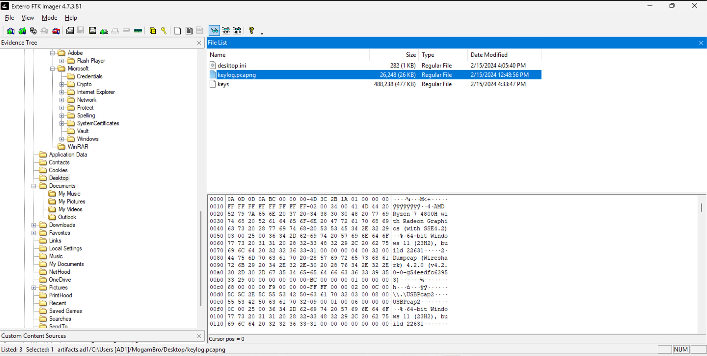

# Bypassing Transport Layer
## Description
The exploit not only manipulated MogamBro's secret but also tried to establish an external TCP connection to gain further access to the machine. But I don't really think he was able to do so. Can you figure out where the exploit was trying to reach to?
## Solution
- Analysed [trace.pcap](./mogambro/trace.pcap) in Wireshark: 
- I didn't know what to do with what I was looking at, so this challenge involved a lot of looking up stuff and learning.
- I realised that this traffic is encrypted. But fortunately, the keys are in the same directory as the `keylog.pcapng` file 
- I looked up how to decrypt the traffic using the keys and found that I need to go to `Edit > Preferences > Protocols > TLS` and add the keys 
- Now we can filter all the decrypted http2 traffic: 
- Going to `File > Export Packet Dissections > as Plain Text...` and selecting the `All expanded` option under `Details` will give us the decrypted traffic in a text file: [decrypted.txt](./decrypted.txt) 
- Searching for the string `bitsctf` in the file gave me the flag: `BITSCTF{5te4l1ng_pr1v47e_key5_ez:)}`.