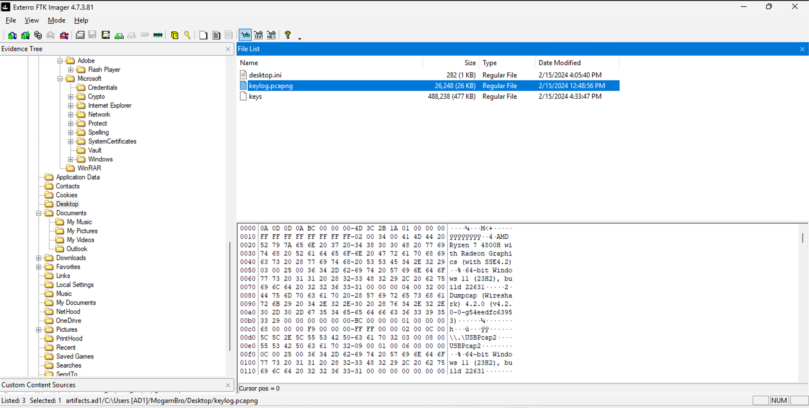
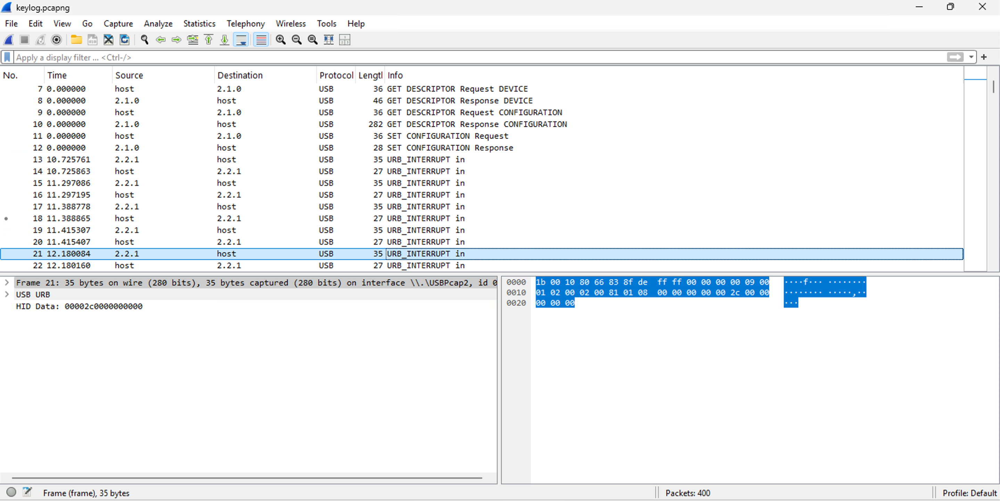
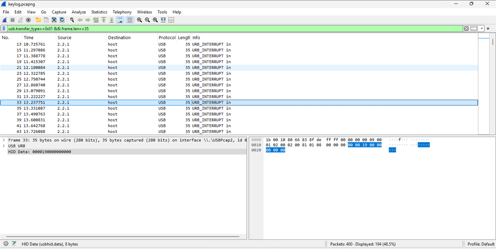

# I'm wired in
## Description
MogamBro got scared after knowing that his PC has been hacked and tried to type a SOS message to his friend through his 'keyboard'. Can you find the contents of that message, obviously the attacker was logging him!
## Solution
- Looking for any files that might contain the keylogged info, I found this on the desktop: 
- I looked up and found that I need a tool called `Wireshark` to open the `keylog.pcapng` file.
- After installing Wireshark, I found this in the packet details: 
- I didn't have any idea what I was looking at, so I talked to an LLM for a bit. I learnt that the packets labelled `URB_INTERRUPT in` are interrupt transfers from a USB device (like a keyboard) to the host. They're used to send time-sensitive data, like keystrokes.
- The packet details contain HID (Human Interface Device) data (for example, `00002c00000000`). I learnt that HID data contains bytes that map to specific keys on a USB keyboard according to the HID Usage Tables (which can be found on page 90 [here](https://usb.org/sites/default/files/hut1_5.pdf)).
- Since there are a lot of packets and we're only interested in the ones having HID data, I learnt that I can apply filters to only show the packets we need. After a bit of trial and error, I finally applied this filter: `usb.transfer_type==0x01 && frame.len==35`. This filter shows only the packets that are interrupt transfers and have a length of 35 bytes (the ones containing HID data) 
- Here's some more info on the HID format:
  - Byte index 0: Modifier key (Shift, Ctrl, Alt, etc.)
  - Byte index 1: Reserved (Always 0)
  - Byte index 2-7: Keycodes for the 6 keys that are currently pressed
- I learnt that when the first byte in the HID data is either 0x02 or 0x20, it means that the Left or Right Shift key is pressed respectively.
- I tried running scripts to automate the process of extracting the keystrokes from the HID data, but I couldn't get them to work. So I manually extracted the keystrokes from the HID data and got this:
```
I havee  been haacckeedd d !!!
HELLPP  MEE
BITSCTF{I_-7h1nk_th3y_4Re_k3yl0991ng_ME!}

~ MogamBro
```
- Assuming I didn't mess up anything, the flag is `BITSCTF{I_-7h1nk_th3y_4Re_k3yl0991ng_ME!}`