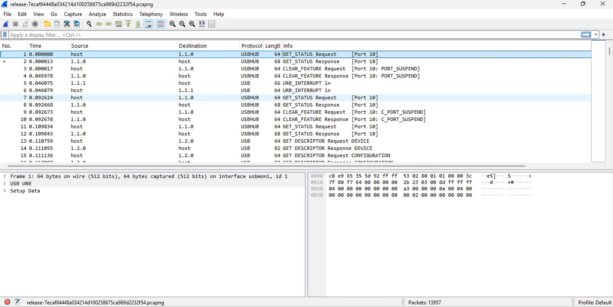
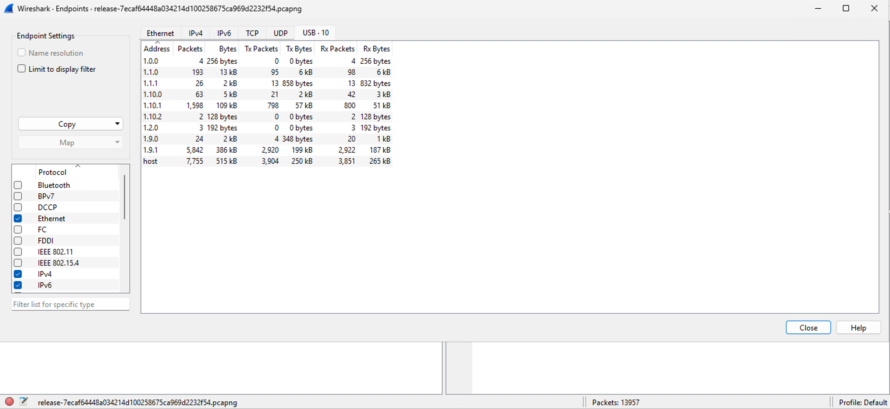
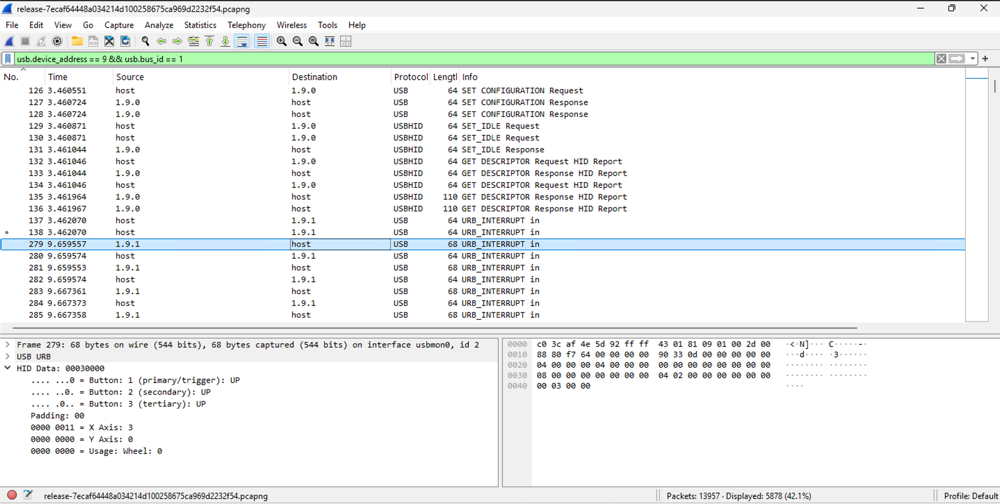
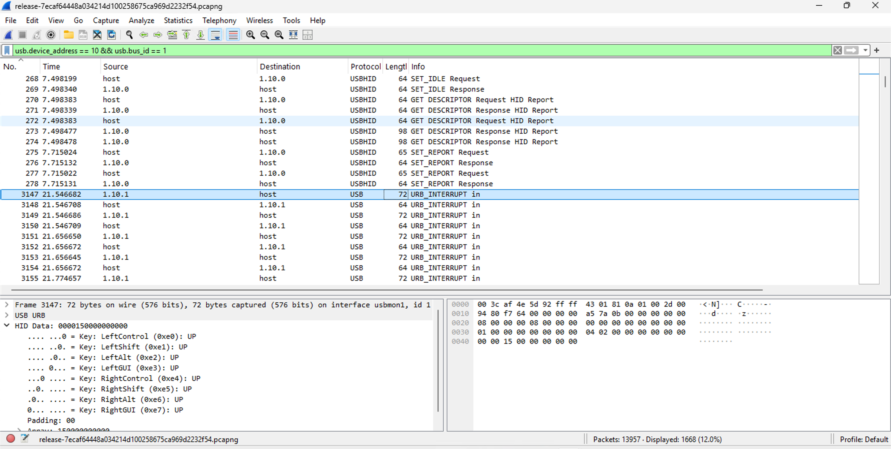
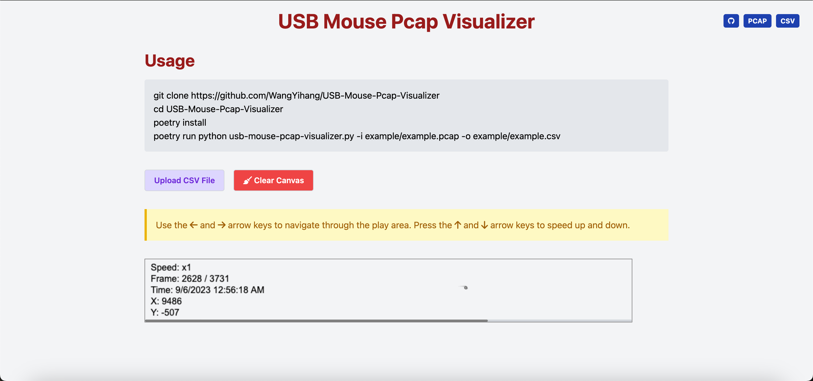
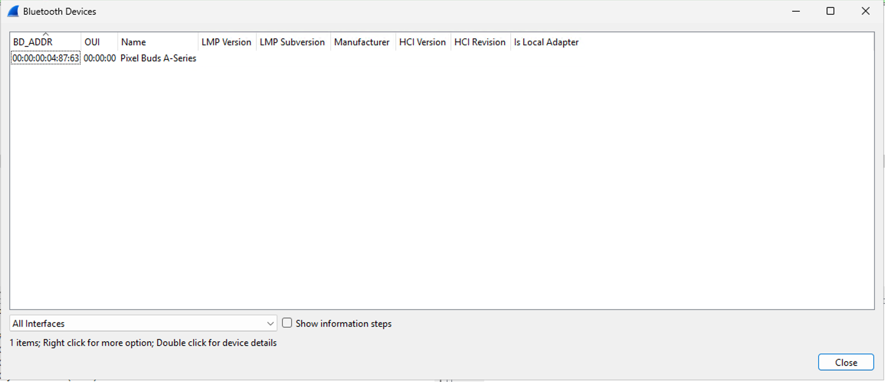
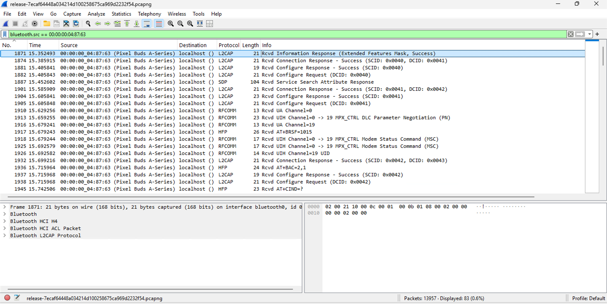
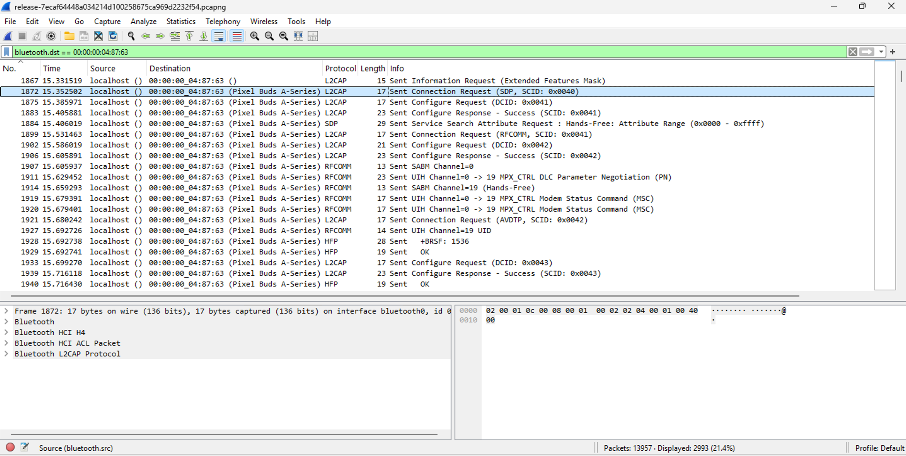
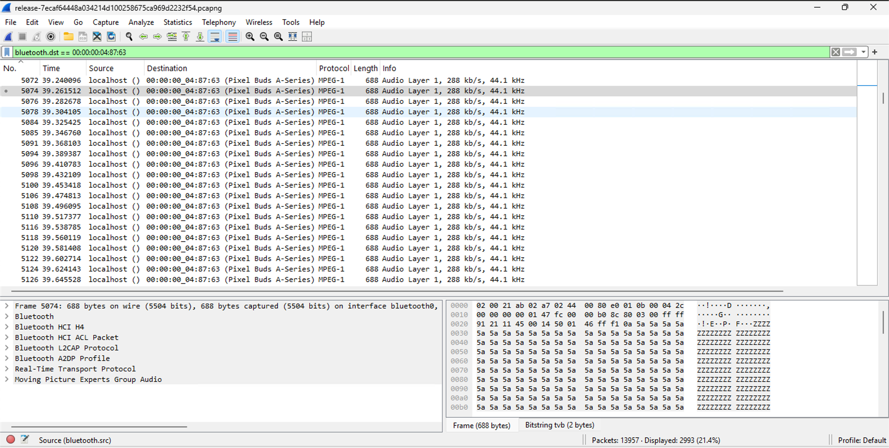
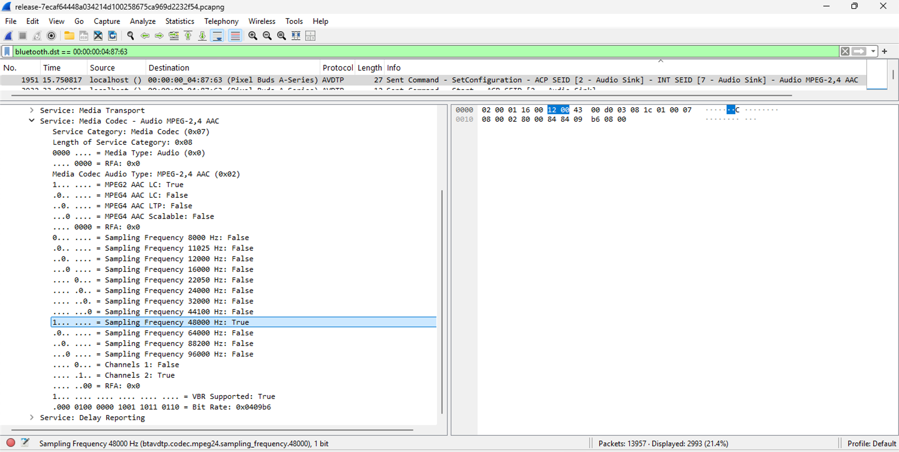

# Not just usbpcap
## Description
I recorded one's USB traffic on his computer, can you find the hidden secret?
BTW for this I want not only the info challenge requires to solve, but all the other too.. once you start solving y'll understand
## Solution
- We're given [release-7ecaf64448a034214d100258675ca969d2232f54.pcapng](hitcon/release-7ecaf64448a034214d100258675ca969d2232f54.pcapng). Opening it in Wireshark: 
Going to `Statistics > Endpoints > USB` shows the USB devices in the capture: 
- There are 2 devices with addresses `1.9.1` and `1.10.1` that have transmitted significant number of packets.
- Applied filter `usb.device_address == 9 && usb.bus_id == 1` to only show the packets from devices with address `1.9.x`. Scrolling down a bit and observing the interrupt packets, I saw that the packets have HID data of 4 bytes. I found out that this USB device is indeed a mouse 
- Similarly, applied filter `usb.device_address == 10 && usb.bus_id == 1` to only show the packets from devices with address `1.10.x`. Observing the interrupt packets, I saw that the packets have HID data of 8 bytes. I found out that this USB device is indeed a keyboard 
- I found [this](https://github.com/TeamRocketIst/ctf-usb-keyboard-parser) tool that can parse the USB keyboard packets. I ran `tshark -r hitcon/release-7ecaf64448a034214d100258675ca969d2232f54.pcapng -Y 'usb.capdata && usb.data_len == 8' -T fields -e usb.capdata` but got no output. An LLM suggested me to try `usbhid.data` instead of `usb.capdata` as `usb.capdata` is a legacy field and `usbhid.data` is specific to HID data and used in newer pcap formats. I ran `tshark -r hitcon/release-7ecaf64448a034214d100258675ca969d2232f54.pcapng -Y 'usbhid.data && usb.data_len == 8' -T fields -e usbhid.data` and got the output in this format:
```
0000000000000000
0000000000000000
0000150000000000
...
```
- The linked tool suggests using `| sed 's/../:&/g2'` to convert the output to the format `00:00:00:00:00:00:00:00`. I ran `tshark -r hitcon/release-7ecaf64448a034214d100258675ca969d2232f54.pcapng -Y 'usbhid.data && usb.data_len == 8' -T fields -e usbhid.data | sed 's/../:&/g2'` but got this error: `sed: 1: "s/../:&/g2": more than one number or 'g' in substitute flags`. 
- An LLM suggested me to use `| sed 's/.\{2\}/&:/g; s/:$//'` instead and I got the output in the desired format after running `tshark -r hitcon/release-7ecaf64448a034214d100258675ca969d2232f54.pcapng -Y 'usbhid.data && usb.data_len == 8' -T fields -e usbhid.data | sed 's/.\{2\}/&:/g; s/:$//'`.
- Here's what `| sed 's/.\{2\}/&:/g; s/:$//'` does:
  - `sed` is the stream editor (a Unix utility that parses and transforms text using regex)
  - `s/` is the substitute command
  - `.\{2\}` matches any 2 characters
  - `&` is the matched string
  - `:` is the colon that we're adding after every 2 characters
  - `g` is the global flag that replaces all occurrences of the pattern in each line
  - `;` is the command separator
  - `:$` matches colon at the end of the line
  - `//` is the replacement string (replaces with nothing)
- I ran `tshark -r hitcon/release-7ecaf64448a034214d100258675ca969d2232f54.pcapng -Y 'usbhid.data && usb.data_len == 8' -T fields -e usbhid.data | sed 's/.\{2\}/&:/g; s/:$//' > usbPcapData` to save the output in the file [usbPcapData](./usbPcapData).
- Copied the script [usbkeyboard.py](./usbkeyboard.py) from the linked tool and ran `python3 usbkeyboard.py usbPcapData` to get the keystrokes:
```
rraaddiioo..cchhaall..hhiittccoonnccttff..ccoomm


Sssoorrrryy,,  nnoo  ffllaagg  hheerree..  Tttrryy  hhaarrddeerr..

Buutt  ii  ccaann  tteellll  yyoouu  tthhaatt  tthhee  ffllaagg  ffoorrmmaatt  iiss  hhiittccoonn{lloowweerr--ccaassee--eenngglliisshh--sseeppaarraatteedd--wwiitthh--ddaasshh}

Aggaaiinn,,  tthhiiss  iiss  nnoott  tthhee  ffllaagg  :(


C88776633!
```
- We didn't get the flag, but we got the format of the flag: `hitcon{lower-case-english-separated-with-dash}`. 
- Now to see what the mouse movements were, I found [this](https://github.com/WangYihang/USB-Mouse-Pcap-Visualizer/tree/master) tool that can visualise the mouse movements from a pcap file. 
- Ran the following commands to install the required dependencies:
  - `git clone https://github.com/WangYihang/USB-Mouse-Pcap-Visualizer`
  - `cd USB-Mouse-Pcap-Visualizer`
  - `pip3 install poetry`
  - `poetry install`
- Ran `poetry run python3 usb-mouse-pcap-visualizer.py -i ../hitcon/release-7ecaf64448a034214d100258675ca969d2232f54.pcapng -o data.csv` and got the following:
```
2024-12-11 14:04:46.721 | INFO     | __main__:main:123 - Namespace(input_file='../hitcon/release-7ecaf64448a034214d100258675ca969d2232f54.pcapng', output_file='data.csv')
13957it [00:12, 1162.26it/s]
2024-12-11 14:04:58.808 | SUCCESS  | __main__:main:127 - 3731 snapshots loaded
2024-12-11 14:04:58.815 | SUCCESS  | __main__:main:129 - mouse snapshots saved to data.csv
2024-12-11 14:04:58.815 | SUCCESS  | __main__:main:130 - visualize the data by opening the assets/index.html file in your browser.
```
- Opened [index.html](USB-Mouse-Pcap-Visualizer/assets/index.html) in my browser, uploaded the [data.csv](USB-Mouse-Pcap-Visualizer/data.csv) file, and saw the mouse movements: 
- But the mouse movements didn't seem to form any pattern or text. They just seem to be normal movements.
- Going to `Wireless > Bluetooth Devices` shows the Bluetooth devices in the capture: 
- Applied the filter `bluetooth.src == 00:00:00:04:87:63` to only show the packets from this device: 
- There weren't many packets and not much useful information could be obtained from this filter. So I changed the filter to `bluetooth.dst == 00:00:00:04:87:63` to show the packets sent to this device: 
- Now we see almost 3000 packets were sent to this device. I saw a lot of audio packets with `MPEG-1` protocol: 
- The flag could be hidden in the audio packets. I scrolled up a bit and found this `SetConfiguration` packet: 
- We see that the audio codec is MPEG2 AAC LC with Sampling Frequency of 48000 Hz and 2 Channels.
- I spent hours trying to extract the audio from the packets. Maybe there was an error with my `tshark` because using `-T fields -e data.data` always gave me blank lines. 
- After some back and forth with an LLM and referring to [this](https://zysgmzb.club/index.php/archives/271) writeup, I was finally able to get the flag:
  - ran `tshark -r hitcon/release-7ecaf64448a034214d100258675ca969d2232f54.pcapng -Y 'bta2dp' -T fields -e "frame[33-687]" > data.txt` to extract the audio data.
  - ran [decode.py](./decode.py) and got [data.latm](./data.latm).
  - ran `ffmpeg -i data.latm 1.wav` to convert the audio to a WAV file.
- Here's the transcript of the audio file using Microsoft Word Web:
```
And gentlemen, welcome back to Secret Flags unveiled on Hit Con Radio. I'm John, your host for this intriguing journey into the world of secret flags. Today, we'll explore the secret flag where flag served as vital information for scoring in CT FS. The secret flags are crucial to the success of hit con CTF and one of them is going to be revealed. Listen carefully. You get only one chance. Flag start. Secret Flags unveiled with Bluetooth radio flag end just simply wrap the text you heard with the flag format. If you find some information missing, just dig deeper in the packet. Stay tuned for more secret flags. This is John signing off from Secret Flags unveiled on Hit Con Radio. Keep those flags flying high. 
```
- The flag is `hitcon{secret-flags-unveiled-with-bluetooth-radio}`.