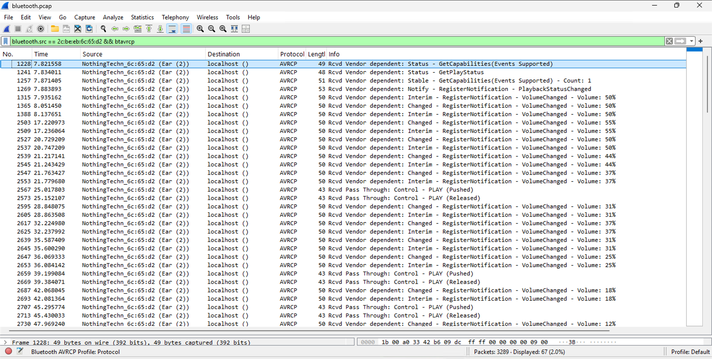

# Bluetooth For The Win
## Description
Mr Jaap Haartsen once told me that he used to have his secret mode of transmission through a technology he invented. There is a saying that he still have one message that no one could ever decrypt, I still have that file (bluetooth.pcap) and I challenge you to retrieve that message. PS: Mind that this guy used to FIDGET a lotttt!!!!
## Solution
- We're given [bluetooth.pcap](shunya/bluetooth.pcap) file. Analysing in Wireshark: 
- Since the challenge's name and description suggest that we're dealing with Bluetooth, I applied the filter `bluetooth`: 
- We see some Bluetooth protocols like `HCI_CMD` and `HCI_USB` in the packets. 
- Going to `Wireless > Bluetooth Devices` shows the Bluetooth devices in the capture: 
- We see a device named `Ear(2)` by `NothingTechn` which are a model of earphones by `Nothing` with `BD_ADDR` as `2c:be:eb:6c:65:d2` (BD_ADDR is the Bluetooth device address which is similar to a MAC address).
- Applied the filter `bluetooth.src == 2c:be:eb:6c:65:d2` to only show the packets from this device: 
- I tried multiple approaches for quite some time to find the flag, but I couldn't find it. I Googled and found [this](https://medium.com/@anantniteshjain/bluetooth-for-the-win-shunya-ctf-arambha-writeup-c5d1134e78f0) writeup which helped me from here.
- I updated the filter to `bluetooth.src == 2c:be:eb:6c:65:d2 && btavrcp` to only show the A/V Remote Control Profile (AVRCP) packets: 
- As the linked writeup suggests, the flag is hidden in the form of morse code in the `AVRCP` packets:
  - Lowering the volume is represented by `.` (dot)
  - Increasing the volume is represented by `-` (dash)
  - Pushed/Released is represented by ` ` (space)
- All the packets  
- The packets are: Increase-Decrease-Decrease-Decrease-Pushed/Released-Decrease-Increase-Decrease-Decrease-Pushed/Released-Decrease-Pushed/Released-Decrease-Decrease-Increase-Increase-Decrease-Increase-Pushed/Released-Decrease-Decrease-Increase-Decrease-Pushed/Released-Increase-Pushed/Released-Decrease-Increase-Increase-Pushed/Released
- Interpreting as morse code: `-... .-.. . ..--.- ..-. - .-- `. Using a [morse code translator](https://morsecodee.com/), we get the text `BLE_FTW`.
- Wrapping it in `0CTF{}` gives us the flag: `0CTF{BLE_FTW}`.