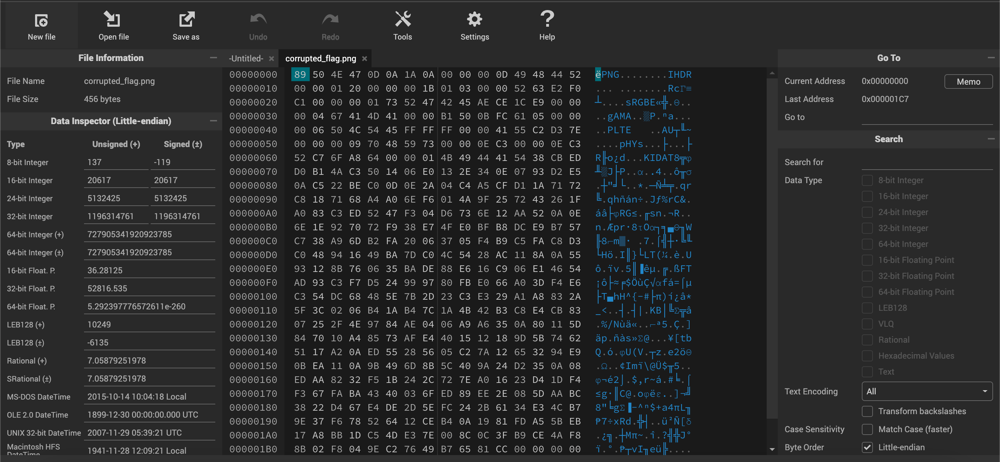
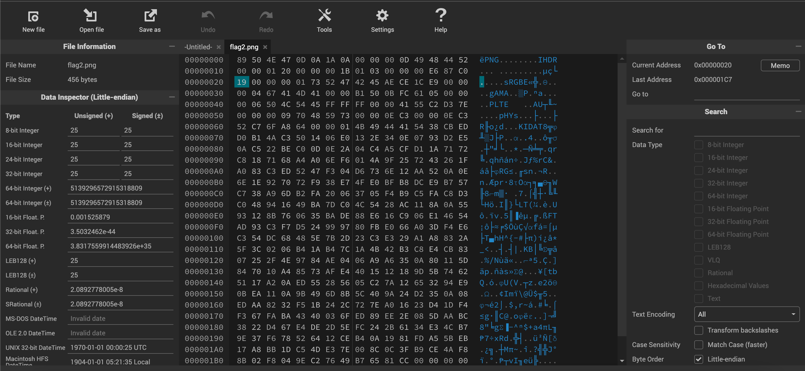
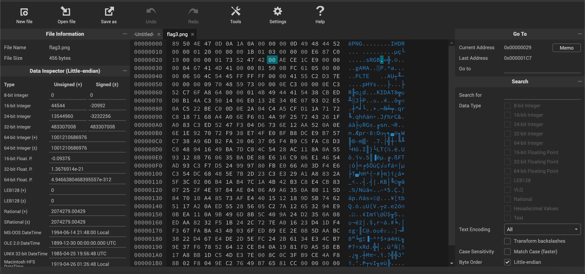
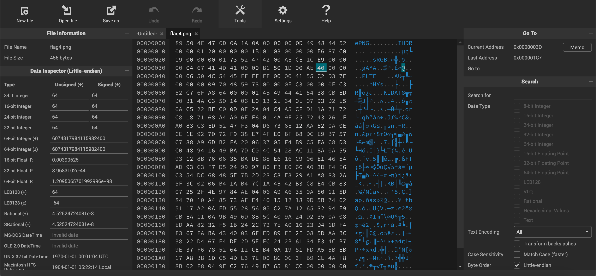
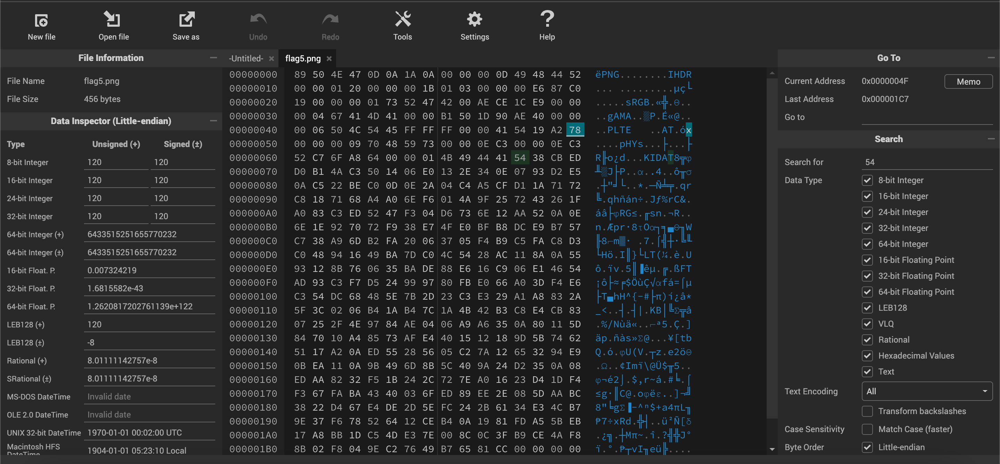

# Check Research and Check again
## Description
Sometimes in life, everything goes wrong, nothing works and you crash every time you try to look within yourself. In such moments, calculate where you came from, and see what you can correct, generally the last thing you did wrong is what needs to be corrected first. Flag Format: 0ctf{words_with_underscore}
## Solution
- We're given [corrupted_flag.png](shunya/corrupted_flag.png). Opening it in a [hex editor](https://hexed.it/): 
- All PNG files have a standard header `89 50 4E 47 0D 0A 1A 0A`. We see in the hex editor that this header is present and not corrupted.
- Running `file corrupted_flag.png` gave us this: `corrupted_flag.png: PNG image data, 288 x 27, 1-bit colormap,`.
- Using exiftool, `exiftool corrupted_flag.png`:
```
ExifTool Version Number         : 12.76
File Name                       : corrupted_flag.png
Directory                       : .
File Size                       : 456 bytes
File Modification Date/Time     : 2024:04:13 18:30:11+05:30
File Access Date/Time           : 2024:12:08 09:57:03+05:30
File Inode Change Date/Time     : 2024:12:08 07:31:16+05:30
File Permissions                : -rw-rw-r--
File Type                       : PNG
File Type Extension             : png
MIME Type                       : image/png
Image Width                     : 288
Image Height                    : 27
Bit Depth                       : 1
Color Type                      : Palette
Compression                     : Deflate/Inflate
Filter                          : Adaptive
Interlace                       : Unknown (82)
SRGB Rendering                  : Unknown (69)
Gamma                           : 2.203
Palette                         : (Binary data 6 bytes, use -b option to extract)
Pixels Per Unit X               : 3779
Pixels Per Unit Y               : 3779
Pixel Units                     : Unknown (82)
Image Size                      : 288x27
Megapixels                      : 0.008
```
- The Interlace, sRGB Rendering, and Pixel Units are unknown. This is probably why the image is corrupted.
- To confirm this, I ran pngcheck `pngcheck -v corrupted_flag.png`:
```
File: corrupted_flag.png (456 bytes)
  chunk IHDR at offset 0x0000c, length 13:  invalid interlace method (82)
ERRORS DETECTED in corrupted_flag.png
```
- The error is due to the unknown interlace method. I'll fix the errors step by step. The byte that needs to be fixed is offset 13 bytes after the chunk `IHDR` aka the byte at `0x1C`. I changed that byte to `00` (no interlace) and saved the file as [flag.png](./flag.png) 
- Running pngcheck again, `pngcheck -v flag.png`:
```
File: flag.png (456 bytes)
  chunk IHDR at offset 0x0000c, length 13
    288 x 27 image, 1-bit palette, non-interlaced
  CRC error in chunk IHDR (computed e687c019, expected 63e2f0c1)
ERRORS DETECTED in flag.png
```
- To fix the CRC error, I need to replace the bytes `63 e2 f0 c1` with `e6 87 c0 19`. I did that and saved the file as [flag2.png](./flag2.png) 
- Running pngcheck again, `pngcheck -v flag2.png`:
```
File: flag2.png (456 bytes)
  chunk IHDR at offset 0x0000c, length 13
    288 x 27 image, 1-bit palette, non-interlaced
  chunk sRGB at offset 0x00025, length 1:  invalid rendering intent
ERRORS DETECTED in flag2.png
```
- The error is due to the unknown rendering intent. The byte that needs to be fixed is offset 1 byte from the chunk `sRGB` aka the byte at `0x29`. I changed that byte to `00` (perceptual) and saved the file as [flag3.png](./flag3.png) 
- Running pngcheck again, `pngcheck -v flag3.png`:
```
File: flag3.png (456 bytes)
  chunk IHDR at offset 0x0000c, length 13
    288 x 27 image, 1-bit palette, non-interlaced
  chunk sRGB at offset 0x00025, length 1
    rendering intent = perceptual
  chunk gAMA at offset 0x00032, length 4: 0.45392
  CRC error in chunk gAMA (computed 1d90ae40, expected 0bfc6105)
ERRORS DETECTED in flag3.png
```
- To fix the CRC error, I need to replace the bytes `0b fc 61 05` with `1d 90 ae 40`. I did that and saved the file as [flag4.png](./flag4.png) 
- Running pngcheck again, `pngcheck -v flag4.png`:
```
File: flag4.png (456 bytes)
  chunk IHDR at offset 0x0000c, length 13
    288 x 27 image, 1-bit palette, non-interlaced
  chunk sRGB at offset 0x00025, length 1
    rendering intent = perceptual
  chunk gAMA at offset 0x00032, length 4: 0.45392
  chunk PLTE at offset 0x00042, length 6: 2 palette entries
  CRC error in chunk PLTE (computed 5419a278, expected 55c2d37e)
ERRORS DETECTED in flag4.png
```
- To fix the CRC error, I need to replace the bytes `55 c2 d3 7e` with `54 19 a2 78`. I did that and saved the file as [flag5.png](./flag5.png) 
- The `.png` is finally not corrupted anymore and we have our flag: 
- Flag: `0ctf{crc_1s_a_us5ful_m5chan1sm}`