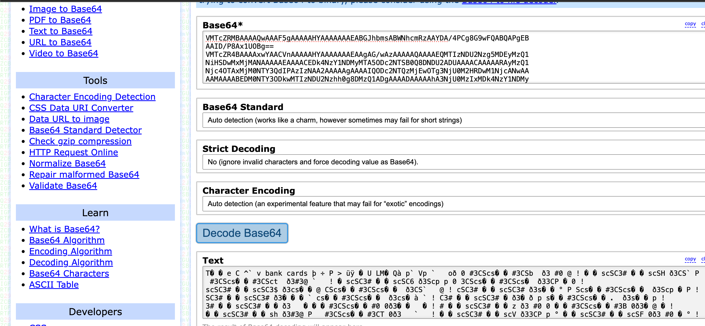

# Smoke Out the Rat
## Description
There was a major heist at the local bank. Initial findings suggest that an intruder from within the bank, specifically someone from the bank’s database maintenance team, aided in the robbery. This traitor granted access to an outsider, who orchestrated the generation of fake transactions and the depletion of our valuable customers’ accounts. We have the phone number, ‘789-012-3456’, from which the login was detected, which manipulated the bank’s employee data. Additionally, it’s noteworthy that this intruder attempted to add gibberish to the binlog and ultimately dropped the entire database at the end of the heist. Your task is to identify the first name of the traitor, the last name of the outsider, and the time at which the outsider was added to the database. Flag format: VishwaCTF{TraitorFirstName_OutsiderLastName_HH:MM:SS}
## Solution
- We're given [DBlog-bin.000007](vishwa/DBlog-bin.000007). I didn't know what a binlog was, so I looked it up and found that it's a binary log file used by MySQL to log changes to the database.
- I ran `strings vishwa/DBlog-bin.000007` and searched for the string `789-012-3456` to find the name of the traitor. I found the name `Matthew Miller`. So the first part of the flag is `Matthew`.
- I found a tool called `mysqlbinlog` that can be used to read the contents of a binlog file. I installed it and ran `mysqlbinlog vishwa/DBlog-bin.000007` to read the contents of the binlog file. 
- In the output, I found some series of Base 64 encoded strings like this one:
```
VMTcZRMBAAAAQwAAAF5gAAAAAHYAAAAAAAEABGJhbmsABWNhcmRzAAYDA/4PCg8G9wFQABQAPgEB
AAID/P8Ax1UOBg==
VMTcZR4BAAAAxwYAACVnAAAAAHYAAAAAAAEAAgAG/wAzAAAAAQAAAAEQMTIzNDU2Nzg5MDEyMzQ1
NiHSDwMxMjMANAAAAAEAAAACEDk4NzY1NDMyMTA5ODc2NTSB0Q8DNDU2ADUAAAACAAAAARAyMzQ1
Njc4OTAxMjM0NTY3QdIPAzIzNAA2AAAAAgAAAAIQODc2NTQzMjEwOTg3NjU0M2HRDwM1NjcANwAA
AAMAAAABEDM0NTY3ODkwMTIzNDU2Nzhh0g8DMzQ1ADgAAAADAAAAAhA3NjU0MzIxMDk4NzY1NDMy
QdEPAzY3OAA5AAAABAAAAAEQNDU2Nzg5MDEyMzQ1Njc4OYHSDwM0NTYAOgAAAAQAAAACEDY1NDMy
MTA5ODc2NTQzMjEh0Q8DNzg5ADsAAAAFAAAAARA1Njc4OTAxMjM0NTY3ODkwodIPAzU2NwA8AAAA
BQAAAAIQNTQzMjEwOTg3NjU0MzIxMAHRDwM4OTAAPQAAAAYAAAABEDY3ODkwMTIzNDU2Nzg5MDHB
0g8DNjc4AD4AAAAGAAAAAhA0MzIxMDk4NzY1NDMyMTA54dAPAzkwMQA/AAAABwAAAAEQNzg5MDEy
MzQ1Njc4OTAxMuHSDwM3ODkAQAAAAAcAAAACEDMyMTA5ODc2NTQzMjEwOTjB0A8DMDEyAEEAAAAI
AAAAARA4OTAxMjM0NTY3ODkwMTIzAdMPAzg5MABCAAAACAAAAAIQMjEwOTg3NjU0MzIxMDk4N6HQ
DwMxMjMAQwAAAAkAAAABEDkwMTIzNDU2Nzg5MDEyMzQh0w8DOTAxAEQAAAAJAAAAAhAxMDk4NzY1
NDMyMTA5ODc2gdAPAzIzNABFAAAACgAAAAEQMDEyMzQ1Njc4OTAxMjM0NUHTDwMwMTIARgAAAAoA
AAACEDA5ODc2NTQzMjEwOTg3NjVh0A8DMzQ1AEcAAAALAAAAARA5ODc2NTQzMjEwOTg3NjU0YdMP
AzEyMwBIAAAACwAAAAIQMTIzNDU2Nzg5MDEyMzQ1NkHQDwM0NTYASQAAAAwAAAABEDg3NjU0MzIx
MDk4NzY1NDOB0w8DMjM0AEoAAAAMAAAAAhAyMzQ1Njc4OTAxMjM0NTY3IdAPAzU2NwBLAAAADQAA
AAEQNzY1NDMyMTA5ODc2NTQzMiHUDwMzNDUATAAAAA0AAAACEDM0NTY3ODkwMTIzNDU2NziBzw8D
Njc4AE0AAAAOAAAAARA2NTQzMjEwOTg3NjU0MzIxQdQPAzQ1NgBOAAAADgAAAAIQNDU2Nzg5MDEy
MzQ1Njc4OWHPDwM3ODkATwAAAA8AAAABEDU0MzIxMDk4NzY1NDMyMTBh1A8DNTY3AFAAAAAPAAAA
AhA1Njc4OTAxMjM0NTY3ODkwQc8PAzg5MABRAAAAEAAAAAEQNDMyMTA5ODc2NTQzMjEwOYHUDwM2
NzgAUgAAABAAAAACEDY3ODkwMTIzNDU2Nzg5MDEhzw8DOTAxAFMAAAARAAAAARAzMjEwOTg3NjU0
MzIxMDk4odQPAzc4OQBUAAAAEQAAAAIQNzg5MDEyMzQ1Njc4OTAxMgHPDwMwMTIAVQAAABIAAAAB
EDIxMDk4NzY1NDMyMTA5ODfB1A8DODkwAFYAAAASAAAAAhA4OTAxMjM0NTY3ODkwMTIz4c4PAzEy
MwBXAAAAEwAAAAEQMTA5ODc2NTQzMjEwOTg3NuHUDwM5MDEAWAAAABMAAAACEDkwMTIzNDU2Nzg5
MDEyMzTBzg8DMjM0AFkAAAAUAAAAARAwOTg3NjU0MzIxMDk4NzY1AdUPAzAxMgBaAAAAFAAAAAIQ
MDEyMzQ1Njc4OTAxMjM0NaHODwMzNDUAWwAAABUAAAABEDk4NzY1NDMyMTA5ODc2NTQh1Q8DMTIz
AFwAAAAVAAAAAhAxMjM0NTY3ODkwMTIzNDU2gc4PAzQ1NgBdAAAAFgAAAAEQODc2NTQzMjEwOTg3
NjU0M0HVDwMyMzQAXgAAABYAAAACEDIzNDU2Nzg5MDEyMzQ1Njdhzg8DNTY3AF8AAAAXAAAAARA3
NjU0MzIxMDk4NzY1NDMyYdUPAzM0NQBgAAAAFwAAAAIQMzQ1Njc4OTAxMjM0NTY3OEHODwM2NzgA
YQAAABgAAAABEDY1NDMyMTA5ODc2NTQzMjGB1Q8DNDU2AGIAAAAYAAAAAhA0NTY3ODkwMTIzNDU2
Nzg5Ic4PAzc4OQBjAAAAGQAAAAEQNTQzMjEwOTg3NjU0MzIxMCHWDwM1NjcAZAAAABkAAAACEDU2
Nzg5MDEyMzQ1Njc4OTCBzQ8DODkw+sQLfQ==
```
- But putting it in a [Base 64 decoder](https://base64.guru/converter/decode) gave me some readable text alongside some gibberish. 
- After going through the binlog entries for about 20 minutes, I found this:
```
# at 80199
#240227 15:31:29 server id 1  end_log_pos 80286 CRC32 0xfd8d1522        Table_map: `bank`.`employees` mapped to number 117
# has_generated_invisible_primary_key=0
# at 80286
#240227 15:31:29 server id 1  end_log_pos 80520 CRC32 0x181c03e7        Update_rows: table id 117 flags: STMT_END_F
```
- This suggests that a new row was added to the `employees` table at 15:31:29. This is likely the outsider who orchestrated the heist. The entry contained the following Base 64 encoded string:
```
+bLdZRMBAAAAVwAAAJ45AQAAAHUAAAAAAAEABGJhbmsACWVtcGxveWVlcwALAw8PCg8PDw8PDwMQ
yADIAJABPAD8A5ABkAFQAP4HAQEAAgP8/wAiFY39
+bLdZR8BAAAA6gAAAIg6AQAAAHUAAAAAAAEAAgAL/////wAAAQAAAARKb2huBVNtaXRor4IPFgBq
b2huLnNtaXRoQGV4YW1wbGUuY29tCjEyMzQ1Njc4OTALADEyMyBNYWluIFN0BgBNdW1iYWkLAE1h
aGFyYXNodHJhBjQwMDAwMQEAAAAAAAEAAAAESm9obgZEYXJ3aW4hjA8TAGpvaG5kb2VAZXhhbXBs
ZS5jb20LKzEyMzQ1Njc4OTALADEyMyBNYWluIFN0BwBBbnl0b3duCABBbnlzdGF0ZQUxMjM0NQEA
AADnAxwY
```
- Decoding this: 
- We see 2 names in the decoded text: `John Smith` and `John Darwin!`. One of them is the outsider. We can try both names in the flag format and submit the flag. 
- The potential flags are `VishwaCTF{Matthew_Smith_15:31:29}` and `VishwaCTF{Matthew_Darwin_15:31:29}`.