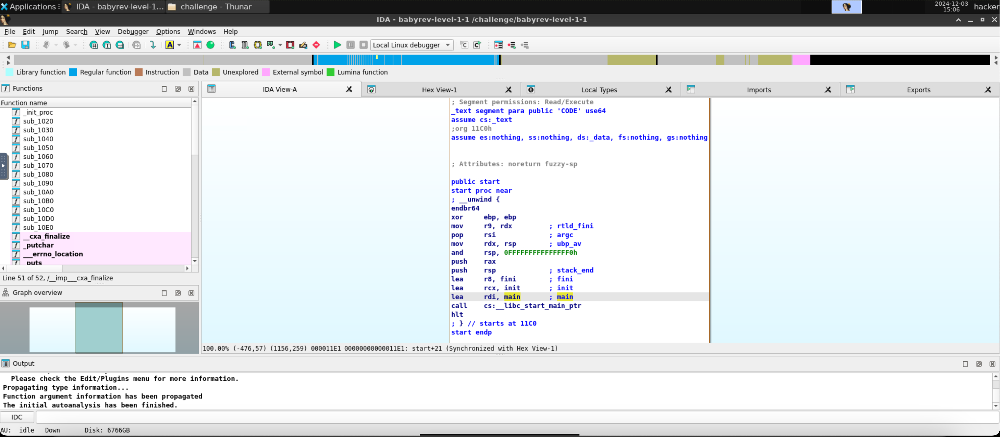
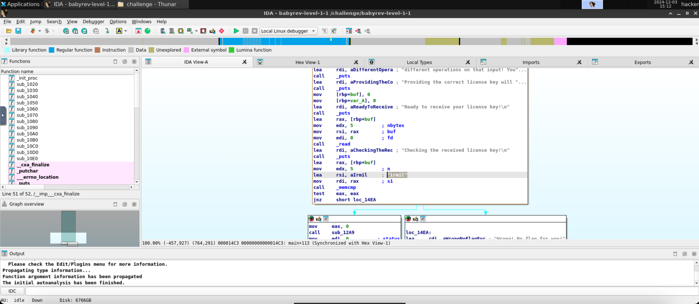

# level1.1
## Description
Reverse engineer this challenge to find the correct license key.
## Solution
- Typed `ls` after cd-ing into `/challenge` to find the name of the executable file: `babyrev-level-1-1`
- ran `./babyrev-level-1-1` and provided `test` as the license key:
```
###
### Welcome to ./babyrev-level-1-1!
###

This license verifier software will allow you to read the flag. However, before you can do so, you must verify that you
are licensed to read flag files! This program consumes a license key over stdin. Each program may perform entirely
different operations on that input! You must figure out (by reverse engineering this program) what that license key is.
Providing the correct license key will net you the flag!

Ready to receive your license key!

test
Checking the received license key!

Wrong! No flag for you!
```
- This time, the program doesn't give us the hex code of the expected license key. So, we need to use a reverse engineering tool now.
- Under the `Useful Tools` section in the [pwn.college](https://pwn.college/program-security/reverse-engineering/) site, I saw the following text: `IDA, accessible via the Desktop in the dojo, is the industry standard of reverse-engineering tools.`
- So I opened the Desktop dojo, navigated the file manager and found the `babyrev-level-1-1` file. I right-clicked on it and selected `Open with IDA Free`.
- I saw this 
- Double clicking on the `main` function, I saw this 
- Found the license key `irmil` in the highlighted comment. I ran the program again and provided `irmil` as the license key:
```
###
### Welcome to ./babyrev-level-1-1!
###

This license verifier software will allow you to read the flag. However, before you can do so, you must verify that you
are licensed to read flag files! This program consumes a license key over stdin. Each program may perform entirely
different operations on that input! You must figure out (by reverse engineering this program) what that license key is.
Providing the correct license key will net you the flag!

Ready to receive your license key!

irmil
Checking the received license key!

You win! Here is your flag:
pwn.college{IOxm76gawUeToPjYp5mgSGMm8ix.0lM1IDL5QTO0czW}
```
- The flag is `pwn.college{IOxm76gawUeToPjYp5mgSGMm8ix.0lM1IDL5QTO0czW}`