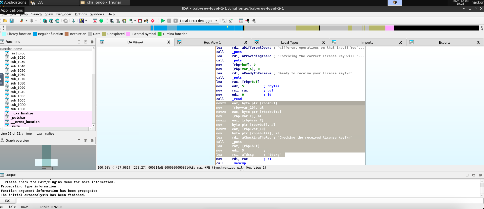

# level2.1
## Description
Reverse engineer this challenge to find the correct license key, but your input will be modified somehow before being compared to the correct key.
## Solution
- The executable program's name is `babyrev-level-2-1`
- Running the program and giving it a test input `abcde`:
```
###
### Welcome to ./babyrev-level-2-1!
###

This license verifier software will allow you to read the flag. However, before you can do so, you must verify that you
are licensed to read flag files! This program consumes a license key over stdin. Each program may perform entirely
different operations on that input! You must figure out (by reverse engineering this program) what that license key is.
Providing the correct license key will net you the flag!

Ready to receive your license key!

abcde
Checking the received license key!

Wrong! No flag for you!
```
- Opening the program in IDA and looking at the main function, this is our snippet of interest 
- `rbp+buf` is where the first byte (i.e. the first character) of the input is stored and `rbp+buf+2` is where the third byte (i.e. the third character) of the input is stored.
- Analyzing what's going on here:
  - `movzx`'s function is to zero-extend (fill the higher bits with zeros) the value in the source operand to the size of the destination operand.
  - `al` refers to the lower 8 bits of the `rax` register and `eax` refers to the lower 32 bits of the `rax` register.
  - `movzx eax, byte ptr [rbp+buf]` zero-extends the byte at `rbp+buf` (index 0 of the input) to a 32-bit value and stores it in `eax`.
  - `mov [rbp+var_10], al` moves the lower 8 bits of `eax` (i.e. the byte at `rbp+buf`) to `rbp+var_10` (a temporary variable).
  - Similarly, `movzx eax, byte ptr [rbp+buf+2]` and `mov [rbp+var_F], al` store the byte at `rbp+buf+2` (index 2 of the input) in `rbp+var_F` (another temporary variable).
  - `movzx eax, [rbp+var_F]` zero-extends the value in `rbp+var_F` (index 2 of the input) to a 32-bit value and stores it in `eax`.
  - `mov byte ptr [rbp+buf], al` moves the lower 8 bits of `eax` (i.e. the byte at `rbp+var_F`) to `rbp+buf` (index 0 of the input).
  - Similarly, `movzx eax, [rbp+var_10]` and `mov byte ptr [rbp+buf+2], al` store the value in `rbp+var_10` (index 0 of the input) in `rbp+buf+2` (index 2 of the input).
- So basically, the program is swapping the first and third characters of the input.
- It later compares it with `tdcxg` (using `memcmp`) and if it matches, it prints the flag.
- To obtain the license key, we need to swap the first and third characters of `tdcxg` to get `cdtxg`.
- Running the program and giving it the correct license key:
```
###
### Welcome to ./babyrev-level-2-1!
###

This license verifier software will allow you to read the flag. However, before you can do so, you must verify that you
are licensed to read flag files! This program consumes a license key over stdin. Each program may perform entirely
different operations on that input! You must figure out (by reverse engineering this program) what that license key is.
Providing the correct license key will net you the flag!

Ready to receive your license key!

cdtxg
Checking the received license key!

You win! Here is your flag:
pwn.college{Qyi5J9JzHdRip4ZV36LuIBf-Rtn.0FN1IDL5QTO0czW}
```
- The flag is `pwn.college{Qyi5J9JzHdRip4ZV36LuIBf-Rtn.0FN1IDL5QTO0czW}`