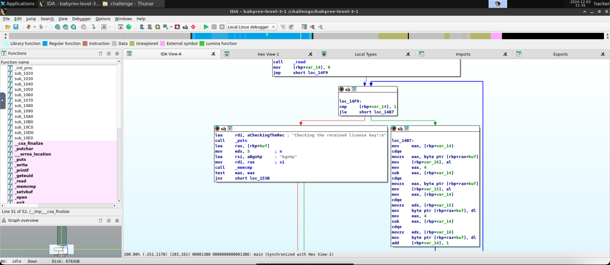

# level3.1
## Description
Reverse engineer this challenge to find the correct license key, but your input will be modified somehow before being compared to the correct key.
## Solution
- The executable program's name is `babyrev-level-3-1`
- Running the program and giving it a test input `abcde`:
```
###
### Welcome to ./babyrev-level-3-1!
###

This license verifier software will allow you to read the flag. However, before you can do so, you must verify that you
are licensed to read flag files! This program consumes a license key over stdin. Each program may perform entirely
different operations on that input! You must figure out (by reverse engineering this program) what that license key is.
Providing the correct license key will net you the flag!

Ready to receive your license key!

abcde
Checking the received license key!

Wrong! No flag for you!
```
- Opening the program in IDA and looking at the main function, this is our portion of interest 
- I looked up what `cdqe` means and found out that it is a sign extension instruction that copies the sign bit of the 32-bit `eax` register into the upper 32 bits of the `rax` register.
- Here's what's going on in the screenshot:
  - `var_14` is being initialised to `0`. We're then comparing `var_14` with `1` and if it's less than or equal to `1`, we enter a loop which does the following:
    - store the value of the byte at `buf+var_14` in `var_16`.
    - store the value of the byte at `buf+4-var_14` in `var_15`.
    - store the value of `var_15` in `buf+var_14`.
    - store the value of `var_16` in `buf+4-var_14`.
    - increment `var_14` by `1`.
  - Compare the mangled input with `bgohp` (using `memcmp`) and if it matches, print the flag.
- So, the loop runs twice. In the first iteration, it swaps the characters at indexes 0 and 4 (as the value of `var_14` is `0`), and in the second iteration, it swaps the characters at indexes 1 and 3 (as the value of `var_14` is `1`).
- This effectively means that the 5-character input is being reversed.
- So, the correct license key is `phogb`.
- Running the program with the correct license key:
```
###
### Welcome to ./babyrev-level-3-1!
###

This license verifier software will allow you to read the flag. However, before you can do so, you must verify that you
are licensed to read flag files! This program consumes a license key over stdin. Each program may perform entirely
different operations on that input! You must figure out (by reverse engineering this program) what that license key is.
Providing the correct license key will net you the flag!

Ready to receive your license key!

phogb
Checking the received license key!

You win! Here is your flag:
pwn.college{kTJYP31y4grTE7KsbN8ZcRmLoe3.0lN1IDL5QTO0czW}
```
- The flag is `pwn.college{kTJYP31y4grTE7KsbN8ZcRmLoe3.0lN1IDL5QTO0czW}`.