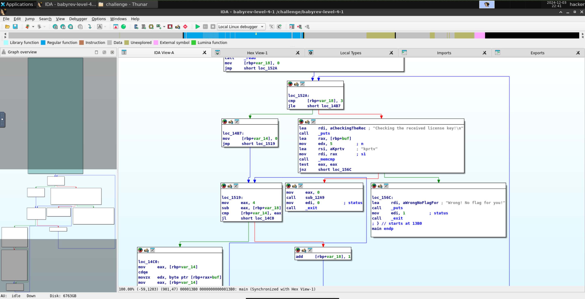
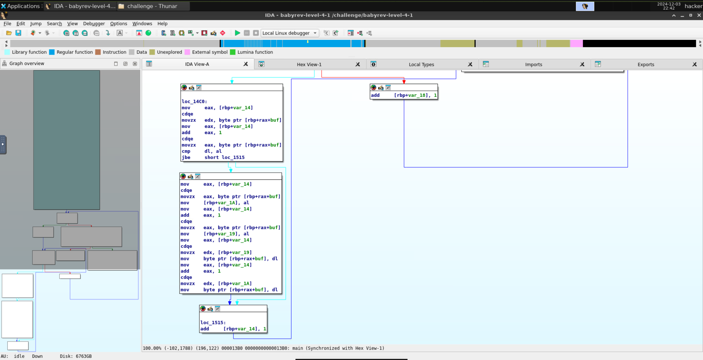

# level4.1
## Description
Reverse engineer this challenge to find the correct license key, but your input will be modified somehow before being compared to the correct key.
## Solution
- The executable program's name is `babyrev-level-4-1`
- Running the program and giving it a test input `bacde`:
```
###
### Welcome to ./babyrev-level-4-1!
###

This license verifier software will allow you to read the flag. However, before you can do so, you must verify that you
are licensed to read flag files! This program consumes a license key over stdin. Each program may perform entirely
different operations on that input! You must figure out (by reverse engineering this program) what that license key is.
Providing the correct license key will net you the flag!

Ready to receive your license key!

bacde
Checking the received license key!

Wrong! No flag for you!
```
- Opening the program in IDA and taking the look at the main function  
- The program seems to be performing bubble sort on the input string and then comparing it with `kprtv`. We'll dive into the bubble sort process later, but first, as we've seen in [level4.0](./level4.0.md), we can directly enter `kprtv` as the license key to get the flag.
- Running the program and giving it the correct input `kprtv`:
```
###
### Welcome to ./babyrev-level-4-1!
###

This license verifier software will allow you to read the flag. However, before you can do so, you must verify that you
are licensed to read flag files! This program consumes a license key over stdin. Each program may perform entirely
different operations on that input! You must figure out (by reverse engineering this program) what that license key is.
Providing the correct license key will net you the flag!

Ready to receive your license key!

kprtv
Checking the received license key!

You win! Here is your flag:
pwn.college{82v2oxMCsKBqDRm7-tGvL5VIiGd.0FO1IDL5QTO0czW}
```
- The flag is `pwn.college{82v2oxMCsKBqDRm7-tGvL5VIiGd.0FO1IDL5QTO0czW}`
- Coming back to the assembly code, first here's the pseudocode of the bubble sort algorithm:
```c
for (i = 0; i <= 3; i++) {
    for (j = 0; j < 4-i; j++) {
        if (buf[j] > buf[j + 1]) {
           // swap buf[j] and buf[j+1]
        }
    }
}
```
- `jbe` is basically `jle` but for unsigned integers.
- So first we initialise our `var_18` with `0` (equivalent to our outer loop iterator `i`), and if it is less than or equal to `3`, we jump to the inner loop.
  - We initialise `var_14` to `0` (equivalent to our inner loop iterator `j`), and if it is less than `4 - var_18`, we jump to the comparison:
    - If `buf[var_14]` is less than or equal to `buf[var_14 + 1]`, we jump to the increment of `var_14` (equivalent to `j++`).
    - Otherwise, we swap `buf[var_14]` and `buf[var_14 + 1]` and jump to the increment of `var_14` (equivalent to `j++`).
    - Comparison of `var_14` with `4-var_18` is done again.
  - Otherwise, we increment `var_18` by 1 (equivalent to `i++`) and jump to the outer loop where the comparison of `var_18` with `3` is done.
- Otherwise we compare the sorted string with `kprtv` (using `memcmp`) and if it is equal, we print the flag.