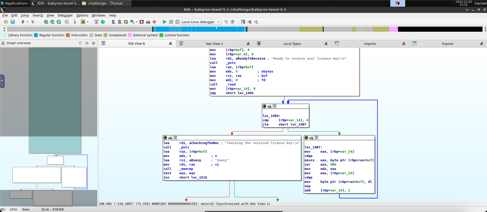

# level5.1
## Description
Reverse engineer this challenge to find the correct license key, but your input will be modified somehow before being compared to the correct key.
## Solution
- The executable program's name is `babyrev-level-5-1`
- Running the program and giving it a test input `bacde`:
```
###
### Welcome to ./babyrev-level-5-1!
###

This license verifier software will allow you to read the flag. However, before you can do so, you must verify that you
are licensed to read flag files! This program consumes a license key over stdin. Each program may perform entirely
different operations on that input! You must figure out (by reverse engineering this program) what that license key is.
Providing the correct license key will net you the flag!

Ready to receive your license key!

bacde
Checking the received license key!

Wrong! No flag for you!
```
- Opening the program in IDA and taking the look at the main function 
- A pseudocode of the xoring process:
```c
for (int i = 0; i <= 4; i++) {
    buf[i] ^= 0x0D;
}
```
- `var_14` is synonymous with `i` in the pseudocode.
- The program is xoring every character of the input with the key `0x0D` (as seen in the operation `xor eax, 0Dh`) and then comparing the result with `duexy`.
- To get the correct license key, we need to xor `duexy` with `0x0D`, which gets us `ixhut`.
- Running the program with the correct license key `ixhut`:
```
###
### Welcome to ./babyrev-level-5-1!
###

This license verifier software will allow you to read the flag. However, before you can do so, you must verify that you
are licensed to read flag files! This program consumes a license key over stdin. Each program may perform entirely
different operations on that input! You must figure out (by reverse engineering this program) what that license key is.
Providing the correct license key will net you the flag!

Ready to receive your license key!

ixhut
Checking the received license key!

You win! Here is your flag:
pwn.college{kGRafQKFcJZtBeptl9h3czgNUTe.0FM2IDL5QTO0czW}
```
- The flag is `pwn.college{kGRafQKFcJZtBeptl9h3czgNUTe.0FM2IDL5QTO0czW}`