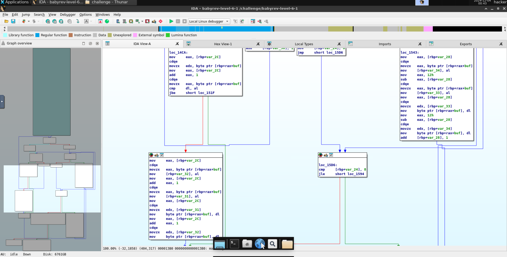

# level6.1
## Description
Reverse engineer this challenge to find the correct license key, but your input will be modified somehow before being compared to the correct key.
## Solution
- The executable program's name is `babyrev-level-6-1`
- Opening the program in IDA and taking the look at the main function   
- Similar to [level6.0](./level6.0.md), the program takes the 19-character input, sorts it, reverses it twice, and compares it to `affghjmmqrsuuvvwxyz`.
- Branch `loc_14C1` takes care of the bubble sort, then `loc_1585` reverses the sorted string, and `loc_15D6` reverses it again.
- We can enter `affghjmmqrsuuvvwxyz` as the license key and get the flag.
- Running the program and entering the correct license key `affghjmmqrsuuvvwxyz`:
```###
### Welcome to ./babyrev-level-6-1!
###

This license verifier software will allow you to read the flag. However, before you can do so, you must verify that you
are licensed to read flag files! This program consumes a license key over stdin. Each program may perform entirely
different operations on that input! You must figure out (by reverse engineering this program) what that license key is.
Providing the correct license key will net you the flag!

Ready to receive your license key!

affghjmmqrsuuvvwxyz
Checking the received license key!

You win! Here is your flag:
pwn.college{gVUn86VJenbsFUXo7e4raxM-tV5.0lM2IDL5QTO0czW}
```
- The flag is `pwn.college{gVUn86VJenbsFUXo7e4raxM-tV5.0lM2IDL5QTO0czW}`.