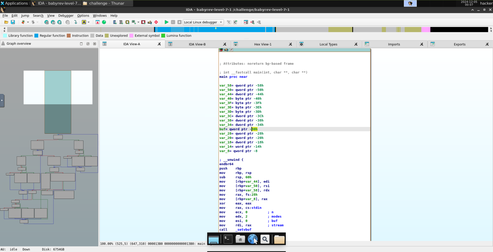
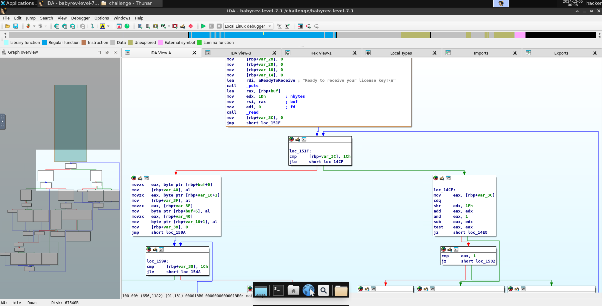
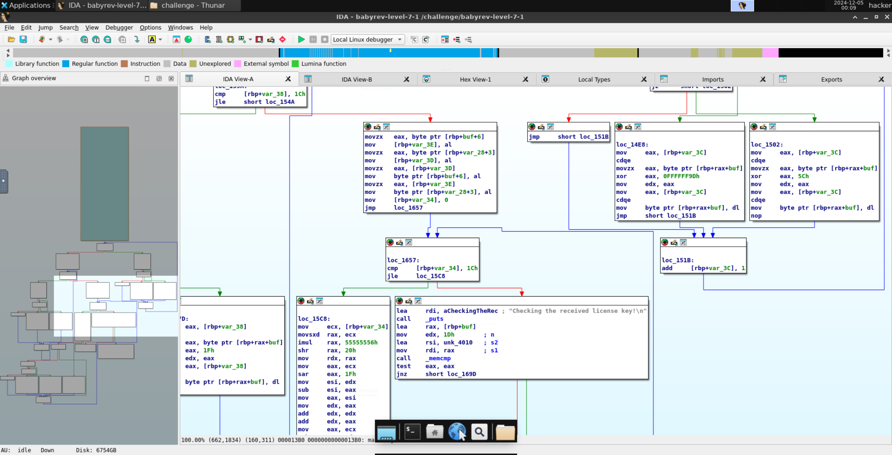
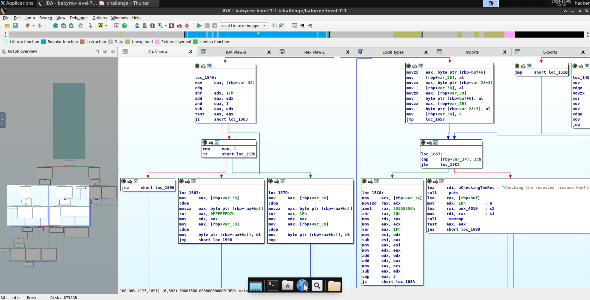
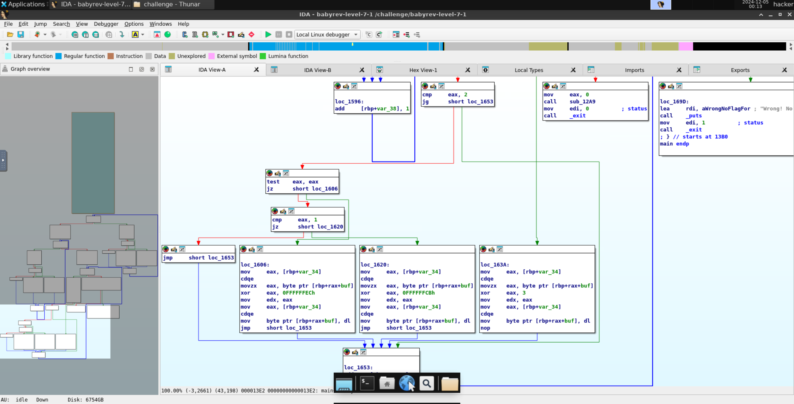
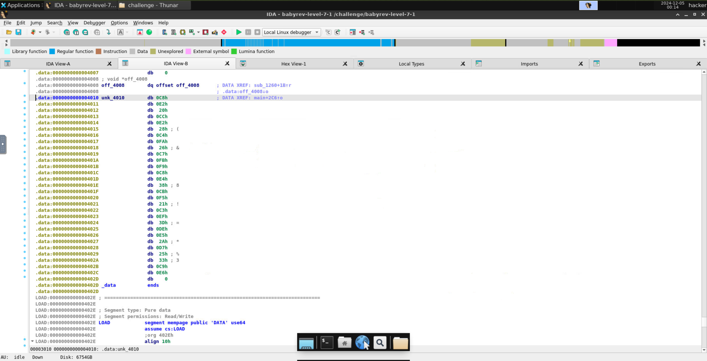

# level7.1
## Description
Reverse engineer this challenge to find the correct license key, but your input will be modified somehow before being compared to the correct key.
## Solution
- The executable program's name is `babyrev-level-7-1`
- Opening the program in IDA and taking the look at the main function and the named variable `unk_4010`      
- There are 29 characters in the license key.
- Branches like `loc_14CF` are actually just checking if the index of `buf` is even or odd. `edx` always remains 0 as our iterating variable is always positive.
- First, the program xors all the even index characters with `0x9D` and all the odd index characters with `0x5C`. 
- Then it swaps the characters at index 6 and 25:
  - `buf` is located at `rbp-0x30` and `var_18` is located at `rbp-0x18`.
  - `var_18+1` maps to `buf+25` as `rbp-0x18 - (rbp-0x30) + 1 = 0x30 - 0x18 + 1 = 0x18 + 1 = 0x19 = 25`.
- Then it xors again:
  - The even indexes are xored with `0xD7` and the odd indexes are xored with `0x1F`.
- Then the character at index 6 is swapped with the character at index 11:
  - Similar to the previous swap, `var_28` is located at `rbp-0x28`.
  - `var_28+3` maps to `buf+11` as `rbp-0x28 - (rbp-0x30) + 3 = 0x30 - 0x28 + 3 = 0x8 + 3 = 0xB = 11`.
- Now, we enter our final xor loop:
  - xors with `0xEC` for `index % 3 == 0`
  - xors with `0xCB` for `index % 3 == 1`
  - xors with `3` for `index % 3 == 2`
- Then it finally compares the result with the key stored at the named variable `unk_4010`.
- The key bytes stored at `unk_4010` are `c8 e2 20 cc e2 28 c4 fa 26 c7 fb f9 c8 e4 38 cb f5 21 c3 ef 3d de e5 2a d7 25 33 c9 e6`.
- I wrote the following [script](level7-1.py) to reverse the mangling process and get the correct key.
```python
# Initial hex array
buf = [0xc8, 0xe2, 0x20, 0xcc, 0xe2, 0x28, 0xc4, 0xfa, 0x26, 0xc7, 0xfb, 0xf9, 
       0xc8, 0xe4, 0x38, 0xcb, 0xf5, 0x21, 0xc3, 0xef, 0x3d, 0xde, 0xe5, 0x2a,
       0xd7, 0x25, 0x33, 0xc9, 0xe6]

# First XOR operations
for i in range(len(buf)):
    if i % 3 == 0:
        buf[i] ^= 0xEC
    elif i % 3 == 1:
        buf[i] ^= 0xCB
    elif i % 3 == 2:
        buf[i] ^= 3

# Swap buf[6] and buf[11]
buf[6], buf[11] = buf[11], buf[6]

# Second XOR operations
for i in range(len(buf)):
    if i % 2 == 0:
        buf[i] ^= 0xD7
    else:
        buf[i] ^= 0x1F

# Swap buf[6] and buf[25]
buf[6], buf[25] = buf[25], buf[6]

# Final XOR operations
for i in range(len(buf)):
    if i % 2 == 0:
        buf[i] ^= 0x9D
    else:
        buf[i] ^= 0x5C

# Convert buf to string
result = ''.join([chr(x) for x in buf])
print(result)
```
- Ran the script and got the correct license key: `njicchlrohzknlqdtaegtqdjqqzfg`.
- Ran the program and entered the key to get the flag.
```
###
### Welcome to ./babyrev-level-7-1!
###

This license verifier software will allow you to read the flag. However, before you can do so, you must verify that you
are licensed to read flag files! This program consumes a license key over stdin. Each program may perform entirely
different operations on that input! You must figure out (by reverse engineering this program) what that license key is.
Providing the correct license key will net you the flag!

Ready to receive your license key!

njicchlrohzknlqdtaegtqdjqqzfg
Checking the received license key!

You win! Here is your flag:
pwn.college{Y8-9XhlG5inK75dzBbfMQLAcX9y.0FN2IDL5QTO0czW}
```
- The flag is `pwn.college{Y8-9XhlG5inK75dzBbfMQLAcX9y.0FN2IDL5QTO0czW}`.