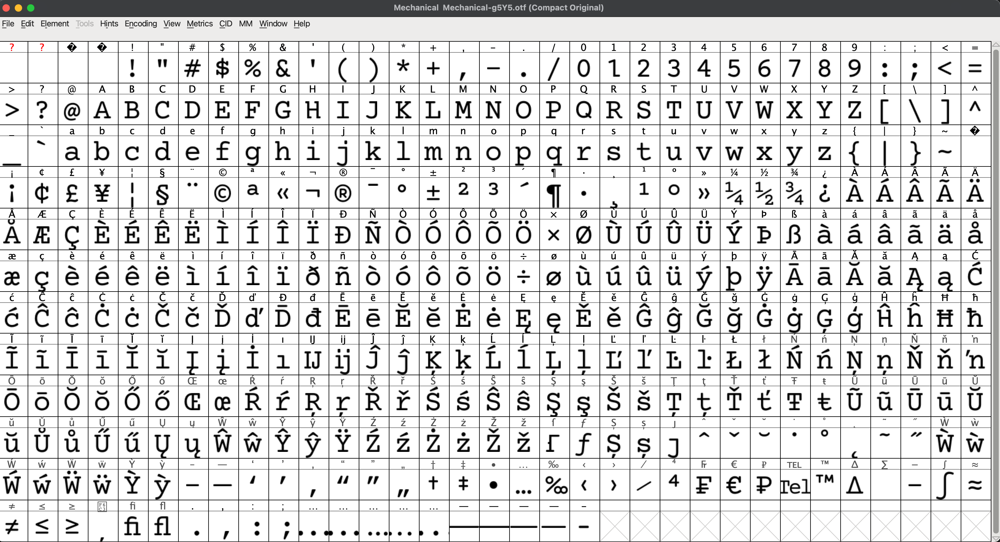

# BuckSpeak
## Description
Buckbeak is trying to say something deep but is frustrated as nobody *bücking* understands him. Can you help him out?
## Hint
_______ music cipher (description?) ( more than just wiki )
## Solution
- We're given [bucking.wav](./bucking.wav) file. 
- Based on the description and hint, I figured out that it's [Bücking Music Cipher](https://en.wikipedia.org/wiki/Music_cipher#:~:text=example%2C%20in%201804%2C-,Johann%20B%C3%BCcking,-devised%20a%20compound).
- I used these 2 tools to decode the message:
  - https://legacy.wmich.edu/mus-theo/ciphers/bucking.html
  - [piano2notes](https://klang.io/piano2notes/)
- Since `piano2notes` had a limit of only 30 seconds for free users, I used [this](https://audiotrimmer.com/) tool to split the audio into multiple files, [bucking2.wav](./bucking2.wav) and [bucking3.wav](./bucking3.wav).
- The music cipher decodes to: `usephrasetruefansreadthebookstohearsomethingdeep`. I interpreted it as, "Use phrase 'true fans read the books' to hear something deep". I tried using the phrase as the flag but it didn't work.
- I had almost given up on this challenge but my teammate Vishion (vishwa2006_73125 on Discord) realised that the `hear something deep` part refers to [DeepSound](https://github.com/Jpinsoft/DeepSound). 
- Downloading the tool and opening the audio file in it, we're asked for a password: 
- I tried the phrase `truefansreadthebooks` as the password and it worked: 
- We have 2 files:
  - [disclaimer.txt](./disclaimer.txt)
  - [screech.mkv](./screech.mkv)
- [discalimer.txt](./disclaimer.txt) doesn't contain anything interesting:
```
(This text file is not concerned with the challenge)
Disclaimer:

We do not own this video. We are just fans who are using it solely for CTF purposes and is not intended for commercial use. The original rights are reserved by the owners(Warner Bros. Pictures). 
```
- [screech.mkv](./screech.mkv) is a video file. I opened it in VLC and it's a scene from Harry Potter: 
- The subtitle says: `Understandable Buckbeak Screeching Noises`, but it's in a slightly different style and honestly, a bit suspicious and weird. 
- I tried tools like exiftool, binwalk, Audacity etc. to find anything hidden in the video but couldn't find anything. 
- Running `ffprobe screech.mkv` gave me the following output:
```
ffprobe version 7.1 Copyright (c) 2007-2024 the FFmpeg developers
  built with Apple clang version 16.0.0 (clang-1600.0.26.4)
  configuration: --prefix=/opt/homebrew/Cellar/ffmpeg/7.1_3 --enable-shared --enable-pthreads --enable-version3 --cc=clang --host-cflags= --host-ldflags='-Wl,-ld_classic' --enable-ffplay --enable-gnutls --enable-gpl --enable-libaom --enable-libaribb24 --enable-libbluray --enable-libdav1d --enable-libharfbuzz --enable-libjxl --enable-libmp3lame --enable-libopus --enable-librav1e --enable-librist --enable-librubberband --enable-libsnappy --enable-libsrt --enable-libssh --enable-libsvtav1 --enable-libtesseract --enable-libtheora --enable-libvidstab --enable-libvmaf --enable-libvorbis --enable-libvpx --enable-libwebp --enable-libx264 --enable-libx265 --enable-libxml2 --enable-libxvid --enable-lzma --enable-libfontconfig --enable-libfreetype --enable-frei0r --enable-libass --enable-libopencore-amrnb --enable-libopencore-amrwb --enable-libopenjpeg --enable-libspeex --enable-libsoxr --enable-libzmq --enable-libzimg --disable-libjack --disable-indev=jack --enable-videotoolbox --enable-audiotoolbox --enable-neon
  libavutil      59. 39.100 / 59. 39.100
  libavcodec     61. 19.100 / 61. 19.100
  libavformat    61.  7.100 / 61.  7.100
  libavdevice    61.  3.100 / 61.  3.100
  libavfilter    10.  4.100 / 10.  4.100
  libswscale      8.  3.100 /  8.  3.100
  libswresample   5.  3.100 /  5.  3.100
  libpostproc    58.  3.100 / 58.  3.100
Input #0, matroska,webm, from 'screech.mkv':
  Metadata:
    MINOR_VERSION   : 512
    COMPATIBLE_BRANDS: 3gp43gp53g2a
    MAJOR_BRAND     : 3gp4
    ENCODER         : Lavf58.76.100
  Duration: 00:00:08.91, start: 0.000000, bitrate: 1168 kb/s
  Stream #0:0: Video: h264 (High), yuv420p(tv, smpte170m/bt470bg/smpte170m, progressive), 640x360, 30 fps, 30 tbr, 1k tbn (default)
      Metadata:
        ENCODER         : Lavc60.3.100 libx264
        DURATION        : 00:00:08.912000000
  Stream #0:1(eng): Audio: aac (LC), 44100 Hz, stereo, fltp (default)
      Metadata:
        HANDLER_NAME    : soun
        VENDOR_ID       : [0][0][0][0]
        ENCODER         : Lavc60.3.100 libfdk_aac
        DURATION        : 00:00:08.892000000
  Stream #0:2: Subtitle: ass (ssa) (default)
      Metadata:
        ENCODER         : Lavc58.134.100 ass
        DURATION        : 00:00:08.890000000
  Stream #0:3: Attachment: ttf
      Metadata:
        filename        : Buckbeak.otf
        mimetype        : application/x-truetype-font
  Stream #0:4: Attachment: ttf
      Metadata:
        filename        : Mechanical-g5Y5.otf
        mimetype        : application/x-truetype-font
Unsupported codec with id 98304 for input stream 3
Unsupported codec with id 98304 for input stream 4
```
- The `ttf` font files are interesting. I extracted them using `ffmpeg -dump_attachment:t "" -i screech.mkv`. This command does the following:
  - The `-dump_attachment:t ""` part extracts all attachments from the input file given by `-i screech.mkv`. 
- I downloaded a tool called [FontForge](https://fontforge.org/en-US/) to analyse the font files. 
- Opening [Mechanical-g5Y5.otf](./Mechanical-g5Y5.otf) first: 
- Nothing seems out of place here. Opening [Buckbeak.otf](./Buckbeak.otf): 
- Now this is VERY interesting. The glyphs don't correspond to the respective characters and I see a lot of underscores. Perhaps the subtitle text in [screen.mkv](./screech.mkv) is encoded using this font.
- I opened [screech.mkv](./screech.mkv) in a text editor. Searching for the string `Understandable`, I was able to extract the subtitle text: `UnderstaNDAblE Buckbēaĸ SCRéècHiɳg-ɲoǐşēЅz`.
- Used this online [tool](https://jumpshare.com/viewer/font) to decode the text using the [Buckbeak.otf](./Buckbeak.otf) font file.
- Got the flag: `nite{w3_b0th_kn0w_wh0_i5_ug1y_h3r3_ma1f0y}`.