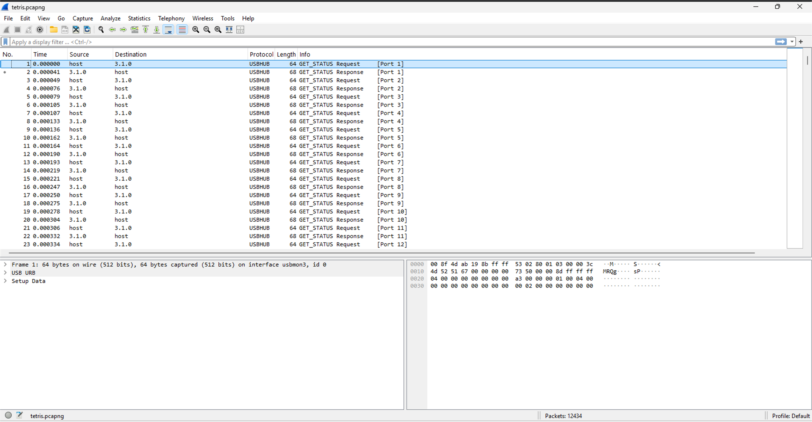
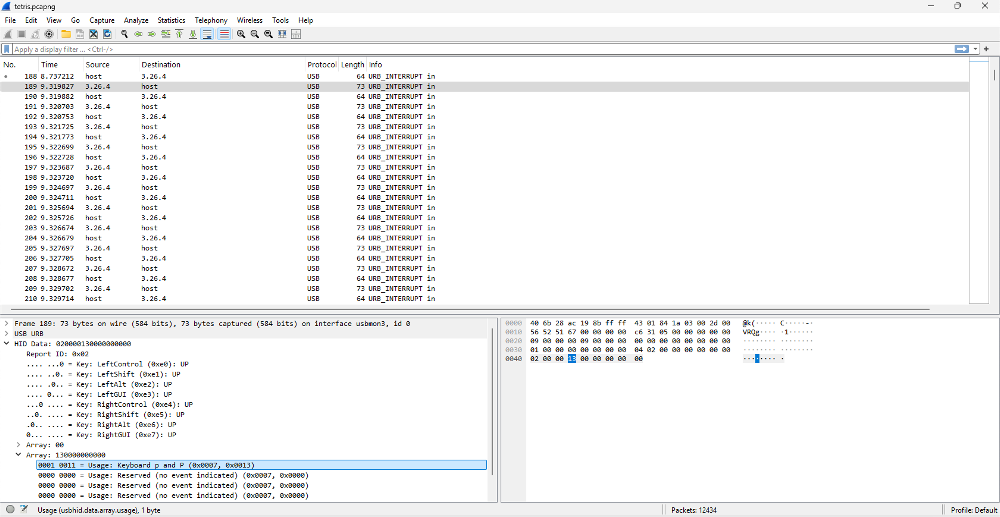
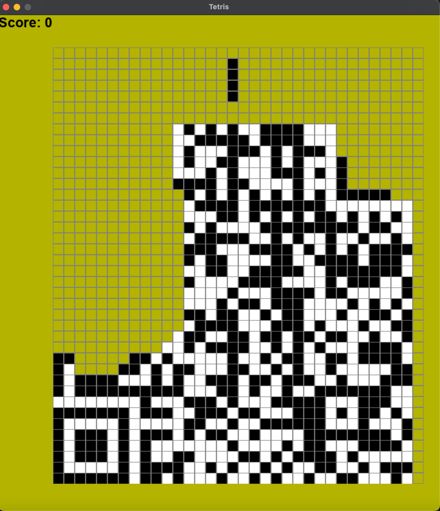

# tet-riffic!
## Description
With no friends to confide in, I seek solace in retro and nostalgic games. I am trying to make something but alas just like the description its not...
## Solution
- Unzipping the provided zip file, we get the folder [handout](./handout/). In it, we have 2 files:
  - [tetris.py](handout/tetris.py)
  - [tetris.pcapng](handout/tetris.pcapng)
- Taking a look at the [tetris.py](handout/tetris.py) file:
```python
import pygame

colors = [
    (0, 0, 0),
    (0, 0, 0),
    (255, 255, 255)
]
b_counter = 0
pre_blocks = [(0,1), (4,1), (0,2), (6,1), (7,2), (5,1), (3,2), (7,1), (7,1), (7,1), 
              (2,2), (7,2), (7,1), (7,1), (7,2), (7,1), (2,2), (7,2), (7,2), (7,1),
              (7,1), (7,2), (5,2), (5,1), (4,2), (7,2), (7,1), (7,2), (7,2), (7,2), 
              (7,1), (6,1), (5,2), (0,1), (2,1), (7,1), (7,2), (7,1), (7,1), (5,2),
              (7,1), (7,1), (7,1), (5,2), (7,1), (1,2), (4,2), (6,2), (3,1), (4,2),
              (0,1), (0,2), (0,2), (0,2), (6,1), (3,1), (7,1), (0,2), (0,1), (4,1),
              (0,1), (3,2), (5,2), (0,1), (7,2), (7,2), (7,1), (7,2), (7,2), (7,1),
              (5,2), (1,1), (7,1), (7,1), (7,2), (7,2), (7,1), (1,2), (7,1), (7,1),
              (7,2), (7,2), (3,2), (7,1), (0,1), (3,1), (3,2), (7,1), (7,1), (0,1),
              (5,1), (0,1), (4,2), (7,1), (4,2), (7,1), (7,2), (7,1), (2,2), (3,1),
              (3,1), (7,2), (6,1), (7,2), (7,2), (7,2), (7,2), (7,1), (7,1), (1,1),
              (3,1), (7,2), (7,2), (7,2), (7,2), (7,1), (7,1), (7,2), (7,2), (1,1),
              (4,2), (7,2), (4,2), (5,1), (5,2), (7,2), (7,2), (7,2), (7,2), (7,2),
              (5,1), (7,2), (5,1), (6,1), (6,1), (7,1), (7,1), (7,1), (7,1), (7,1),
              (6,1), (6,1), (0,1), (3,1), (6,2), (7,1), (7,1), (7,2), (7,2), (4,2),
              (2,1), (7,2), (7,2), (1,2), (7,1), (7,1), (5,1), (1,2), (7,1), (7,2),
              (4,2), (5,1), (3,1), (2,2), (7,2), (7,2), (7,1), (7,2), (7,1), (7,1),
              (7,2), (2,2), (7,1), (7,1), (1,2), (5,1), (7,1), (7,2), (7,2), (7,1), 
              (7,1), (7,1), (7,1), (7,1), (7,1), (7,2), (1,2), (7,1), (7,2), (7,2),
              (7,1), (7,1), (7,2), (4,2), (7,2), (7,2), (7,2), (4,1), (7,2), (4,2),
              (0,2), (3,1), (3,1), (6,1), (6,1), (4,1), (5,1), (7,2), (7,2), (7,2),
              (7,2), (7,2), (7,2), (7,1), (7,2), (7,2), (7,2), (6,1), (7,2), (7,2),
              (7,1), (7,1), (7,1), (0,1), (3,2), (0,2), (7,1), (7,1), (7,1), (7,2),
              (2,1), (2,2), (5,1), (7,1), (7,1), (7,1), (7,1), (7,1), (7,1), (7,1),
              (7,1), (7,2), (7,2), (7,2), (7,2), (7,2), (7,2), (7,2), (7,2), (5,1),
              (7,1), (6,1), (7,1), (7,2), (5,2), (7,1), (4,2), (4,1), (5,2), (7,2),
              (7,2), (7,2), (5,1), (5,1), (4,2), (7,1), (7,1), (7,1), (7,1), (7,2),
              (0,1), (3,2), (7,1), (7,1), (7,2), (7,1), (1,2), (0,1), (4,2), (7,1),
              (7,1), (5,2), (7,1), (7,2), (7,2), (7,1), (5,2), (7,2), (6,1), (7,2), 
              (7,1), (7,1), (7,1), (7,2), (7,2), (7,2), (5,2), (6,1), (4,2), (7,2), 
              (7,2), (7,2), (7,1), (0,1), (7,1), (7,2), (5,1), (4,2), (5,2), (4,2),
              (7,1), (5,2), (4,1), (4,1), (7,2), (7,2), (7,2), (2,2), (7,2), (4,2),
              (6,1), (6,1), (7,1), (7,1), (7,1), (7,1), (7,1), (7,2), (7,2), (1,1),
              (7,2), (7,1), (7,1), (6,2), (7,1), (5,2), (1,1), (7,2), (7,1), (5,2),
              (7,1), (0,1), (5,1), (7,2), (7,2), (7,2), (7,2), (7,2), (7,1), (0,1),
              (7,1), (5,1), (1,1), (7,1), (7,2), (7,2), (7,2), (4,2), (5,2), (7,1),
              (7,1), (5,1), (7,2), (7,2), (3,2), (7,1), (7,2)
              ]

class Figure:
    x = 0
    y = 0

    figures = [
        [[1, 5, 9, 13], [4, 5, 6, 7]],                                  # I block 
        [[4, 5, 9, 10], [2, 6, 5, 9]],                                  # Z block
        [[6, 7, 9, 10], [1, 5, 6, 10]],                                 # S block
        [[1, 2, 5, 9], [0, 4, 5, 6], [1, 5, 9, 8], [4, 5, 6, 10]],      # J block
        [[1, 2, 6, 10], [5, 6, 7, 9], [2, 6, 10, 11], [3, 5, 6, 7]],    # L block
        [[1, 4, 5, 6], [1, 4, 5, 9], [4, 5, 6, 9], [1, 5, 6, 9]],       # T block
        [[1, 2, 5, 6]],                                                 # O block                 
        [[1, 1, 1, 1]]                                                  # Cheat block
    ]

    def __init__(self, type, color):
        self.x = 15
        self.y = 0
        self.type = type
        self.color = color
        self.rotation = 0

    def image(self):
        return self.figures[self.type][self.rotation]

    def rotate(self):
        self.rotation = (self.rotation + 1) % len(self.figures[self.type])


class Tetris:
    def __init__(self, height, width):
        self.level = 2
        self.score = 0
        self.state = "start"
        self.field = []
        self.height = 0
        self.width = 0
        self.x = 100
        self.y = 60
        self.zoom = 20
        self.figure = None
    
        self.height = height
        self.width = width
        self.field = []
        self.score = 0
        self.state = "start"
        for i in range(height):
            new_line = []
            for j in range(width):
                new_line.append(0)
            self.field.append(new_line)

    def new_figure(self, counter):
        global b_counter
        b_counter = counter
        while b_counter < len(pre_blocks):
            a, b = pre_blocks[b_counter]
            b_counter += 1
            self.figure = Figure(a, b)
            return

        self.figure = Figure(0, 0)
    def intersects(self):
        intersection = False
        for i in range(4):
            for j in range(4):
                if i * 4 + j in self.figure.image():
                    if i + self.figure.y > self.height - 1 or \
                            j + self.figure.x > self.width - 1 or \
                            j + self.figure.x < 0 or \
                            self.field[i + self.figure.y][j + self.figure.x] > 0:
                        intersection = True
        return intersection

    def break_lines(self):
        lines = 0
        for i in range(1, self.height):
            zeros = 0
            for j in range(self.width):
                if self.field[i][j] == 0:
                    zeros += 1
            if zeros == 0:
                lines += 1
                for i1 in range(i, 1, -1):
                    for j in range(self.width):
                        self.field[i1][j] = self.field[i1 - 1][j]
        self.score += lines ** 2

    def go_space(self):
        while not self.intersects():
            self.figure.y += 1
        self.figure.y -= 1
        self.freeze()

    def go_down(self):
        self.figure.y += 1
        if self.intersects():
            self.figure.y -= 1
            self.freeze()

    def freeze(self):
        for i in range(4):
            for j in range(4):
                if i * 4 + j in self.figure.image():
                    self.field[i + self.figure.y][j + self.figure.x] = self.figure.color
        self.break_lines()
        self.new_figure(b_counter)
        if self.intersects():
            self.state = "gameover"

    def go_side(self, dx):
        old_x = self.figure.x
        self.figure.x += dx
        if self.intersects():
            self.figure.x = old_x

    def rotate(self):
        old_rotation = self.figure.rotation
        self.figure.rotate()
        if self.intersects():
            self.figure.rotation = old_rotation


pygame.init()


BLACK = (0, 0, 0)
WHITE = (255, 255, 255)
GRAY = (128, 128, 128)
RED = (180, 180, 0)
size = (810, 910)
screen = pygame.display.set_mode(size)

pygame.display.set_caption("Tetris")


done = False
clock = pygame.time.Clock()
fps = 1
game = Tetris(40, 34)
counter = 0

pressing_down = False

while not done:
    if game.figure is None:
        game.new_figure(b_counter) 
    counter += 1
    if counter > 100000:
        counter = 0

    if counter % ( game.level // 2) == 0 or pressing_down:
        if game.state == "start":
            game.go_down()
            pass

    for event in pygame.event.get():
        if event.type == pygame.QUIT:
            done = True
        if event.type == pygame.KEYDOWN:
            if event.key == pygame.K_w:
                game.rotate()
            if event.key == pygame.K_s:
                game.go_down()
            if event.key == pygame.K_a:
                game.go_side(-1)
            if event.key == pygame.K_d:
                game.go_side(1)
            if event.key == pygame.K_SPACE:
                game.go_space()
            if event.key == pygame.K_ESCAPE:
                game.__init__(810, 910)

    if event.type == pygame.KEYUP:
            if event.key == pygame.K_DOWN:
                pressing_down = False

    screen.fill(RED)

    for i in range(game.height):
        for j in range(game.width):
            pygame.draw.rect(screen, GRAY, [game.x + game.zoom * j, game.y + game.zoom * i, game.zoom, game.zoom], 1)
            if game.field[i][j] > 0:
                pygame.draw.rect(screen, colors[game.field[i][j]],
                                 [game.x + game.zoom * j + 1, game.y + game.zoom * i + 1, game.zoom - 2, game.zoom - 1])

    if game.figure is not None:
        for i in range(4):
            for j in range(4):
                p = i * 4 + j
                if p in game.figure.image():
                    pygame.draw.rect(screen, colors[game.figure.color],
                                     [game.x + game.zoom * (j + game.figure.x) + 1,
                                      game.y + game.zoom * (i + game.figure.y) + 1,
                                      game.zoom - 2, game.zoom - 2])

    font = pygame.font.SysFont('Calibri', 25, True, False)
    font1 = pygame.font.SysFont('Calibri', 65, True, False)
    text = font.render("Score: " + str(game.score), True, BLACK)
    text_game_over = font1.render("Game Over", True, (255, 125, 0))
    text_game_over1 = font1.render("Press ESC", True, (255, 215, 0))

    screen.blit(text, [0, 0])
    if game.state == "gameover":
        screen.blit(text_game_over, [20, 200])
        screen.blit(text_game_over1, [25, 265])

    pygame.display.flip()

    clock.tick(fps)

pygame.quit()
```
- We see that the script is a Tetris game written in Python using the `pygame` library. The game is controlled using the following keys:
  - `w`: Rotate the block
  - `s`: Move the block down
  - `a`: Move the block left
  - `d`: Move the block right
  - `space`: Move the block to the bottom
  - `esc`: Restart the game
- The game has a `pre_blocks` list that contains the blocks that will be used in the game. The blocks are represented by a tuple of 2 integers. The first integer represents the type of the block and the second integer represents the color of the block. The blocks are stored in the list in the order they will be used in the game.
- In the `figures` list of the `Figure` class, we see a `Cheat block` which is quite interesting.
- Opening the provided [tetris.pcapng](handout/tetris.pcapng) file in Wireshark: 
- Scrolling a bit down, we see a lot of USB interrupts. Looking at the HID data of the interrupts, it's clear that the USB device is a keyboard and these packets are keystrokes: 
- I used the same technique as in the challenge [Not just usbpcap.md](../STP_2/Forensics/Hitcon'23/Not%20just%20usbpcap.md) to extract the keystrokes from the pcap file. 
- I ran `tshark -r handout/tetris.pcapng -Y 'usbhid.data && usb.data_len == 8' -T fields -e usbhid.data` but got no output. Investigating in Wireshark, I realised that the HID data consists of 9 bytes instead of 8. I ran `tshark -r handout/tetris.pcapng -Y 'usbhid.data && usb.data_len == 9' -T fields -e usbhid.data | sed 's/.\{2\}/&:/g; s/:$//' | head` to extract the keystrokes and got this output:
```
02:00:00:13:00:00:00:00:00
02:00:00:00:00:00:00:00:00
02:00:00:1c:00:00:00:00:00
02:00:00:00:00:00:00:00:00
02:00:00:17:00:00:00:00:00
02:00:00:00:00:00:00:00:00
02:00:00:0b:00:00:00:00:00
02:00:00:00:00:00:00:00:00
02:00:00:12:00:00:00:00:00
02:00:00:00:00:00:00:00:00
```
- Ran `tshark -r handout/tetris.pcapng -Y 'usbhid.data && usb.data_len == 9' -T fields -e usbhid.data | sed 's/.\{2\}/&:/g; s/:$//' > usbPcapData` to save the output in the file [usbPcapData](./usbPcapData).
- I realised that the HID data is 9 bytes because the first byte is the report ID and it is `0x02` for all the keystrokes in the pcap file. I used Find and Replace to remove the first byte from all the lines in the file. Now the file has the keystrokes in the format `00:00:13:00:00:00:00:00`.
- Used the script [usbkeyboard.py](./usbkeyboard.py) to extract the keystrokes from the file `python3 usbkeyboard.py usbPcapData > keystrokes.txt`. [keystrokes.txt](./keystrokes.txt) has the following:
```python3 tetris.py 
waaaaaaaaaaaaaaa aaaaaaaaaaaawww aaaaaaaaa aaaaaaaa aaaaaa aaaaaw aaaw aa a dd da ddd dddd ddd dddd ddddddd ddddd dddddddd ddddddddd dddddddddd ddddddddddd dddddddddddddddd ddddddddddddd dddddddddddddddww ddddddddddddddwww ddddddddddddd dddddddddddd dddddddddddd ddddddddddd dddddddddd ddddddddddd dddddddd ddddddddddww dddddddddddddw dddddd ddddd ddddd ddddd dddd dddwww dd d da awww aaaa aaaw wwwaaaaa aaaaaaa aaaaaaaa aaaaaaaaaw aaaaaaaaaa aaaaaaaaaaa aaaaaaaaaaaaaaw aaaaaaaaaaaaaaa aaaaaaaaaaaaa aaaaaaaaaaaaaa aaaaaaaaaaaa aaaaaaaaaaaaaw aaaaaaaaaaaaaaaa waaaaaaaaaaaaaaaa waaaaaaaaaaaa aaaaaaaaaawww aaaaaaaaaaaaaaaa aaaaaaaaaaaaaaaa aaaaaaaaaaaaaaa aaaaaaaaaaaaaaa aaaaaaaaaaaaaaa aaaaaaaaaaaaa aaaaaaaaaaaa wwwaaaaaa waaaaa waaaa aa a aa a  d dd  d dd wwwddddd ddddddd wddddddddd wddddddddddddd wwwdddddddddddddd dddddddddddddddd dddddddddddddddd wdddd wddddddd dddddddd wwwddddddddd dddddddddd wddddddddd ddddddddddddd dddddddddddddd ddddddddddddddd wddddddddddddddd wwdddddddddddddd dddddddddddd dddddddddddddddd ddddddddddddddd  ddddd dddd ddd dd d aa waaaaaaa aaaa aaaaa aaaaaa aaaaaaa aaaa  a aa a ww ddddddddddddd wdddddddddddd dddddddddd wddddddddddd dddddddddddddddd dddddddddddddddd dddddddd ddddddddd ddddddd ddddd dddddd dddddd dddddddddddddd dddddddddddd ddddddddd ddddddddd dddddddddd dd dd aaaaaaaaaaaaaa aaaaaaaaaaaa waaaaaaaaa wwaaaaa aaaa aaaaaaa aaaaaaa aaaaaa aaaaaa wwwaaaaaaaaaa aaaaaaaaaa ddddddd ddddd wddd dddd ddd www dd ddd dddd wwd wdddd wwdddddd wddddddd ddddd ddddd dddddddd ddddddddd ddddddd ddddddddd dddddddd dddddddddd dddddddddd ddddddddddddd dddddddddddddd wdddddddddddddddd dddddddddddd ddddddddddddddd dddddddddddddddd ddddddddddddd ddddddddddddd dddddddddddddd ddddddddddddddd dddddddddddddddd dddddddddddddddd dddddddddddddd wddddddddddd dddddddd dddddddddd ddddddddd dddddddddd ddddddddddd dddddddddddd wwwddddddddddddd dddddddddddddddd dddddddddddddddd dddddddddddddd wddddddddddddd ddddddddddd wddddddd wdddddddd wwdddddd ddddd ddddddddddd ddddddddddddd wwdddddddd wwwddddddddddddddd dddddddddddd dddddddddddd ddddddddddddd dddddddddddddd dddddddddd dddddddd ddddddd dd ddd dddd  d d d dd ddd dddd wwwdd wdddddd dddd ddddd dddddd dddddddd wdddd wdddddd wwdddddddddd ddddddd ddddddddd ddddddddddd dddddddddddd ddddddddddddd dddddddddddddd ddddddddddddd dddddddd dddddddd dddddddd ddddd ddddddd dddddddddd dddddddddd ddddddddddd dddddddddddd wwdddddd ddddddddd dd d d wdddddddddddddddd ddddddddddddddd wdddddddddddddd wwwddddddddd wwdddddddddddd dddddddddd ddddddd ddddd wwwdddddddd wwdddddd wwdddddddd dddddddd dddddd dddddd dddddd ddddddd dddd wdd dd ddd ddddd d dd wdddddddddddd wwwaaa a aaaa aaa aa aa a aaaaaa waaaaa aaaaaaa a  a  aa aa aa aa wwa aa a d d d d dddddddddd ddd ddd wwwdd wddd wwdd wwdddddd dddddddd wddddddddd wdddddd wwddd ddddd ddddd ddddddddd ddddddd ddddddd wwwd ddddd ddd  a aa aa aa a  waaaa aaaa aaa aaaa aaaa aaaa waaa waaaa aaaa aaaa wwaaa a  aa a a a aaa aaaa aaaa waaaa aa w d  d dd dd wwwaaaaa wwaa aaaa aaaa aa aaa a aaaaa aaaa aaaaa 
```
- Observing the keystrokes in Wireshark, I saw that the `python3 tetris.py` command was executed, then after 2 seconds, the keystrokes for the Tetris game were sent with a gap of 0.05 seconds between each keystroke. To replicate this, with the help of an LLM, I wrote a script [automate_tetris.py](./automate_tetris.py) that simulates the keystrokes in [keystrokes.txt](./keystrokes.txt):
```python
import time
import pyautogui
import subprocess

# Define the game command and keystrokes
game_command = "python3 handout/tetris.py"
keystrokes = "waaaaaaaaaaaaaaa aaaaaaaaaaaawww aaaaaaaaa aaaaaaaa aaaaaa aaaaaw aaaw aa a dd da ddd dddd ddd dddd ddddddd ddddd dddddddd ddddddddd dddddddddd ddddddddddd dddddddddddddddd ddddddddddddd dddddddddddddddww ddddddddddddddwww ddddddddddddd dddddddddddd dddddddddddd ddddddddddd dddddddddd ddddddddddd dddddddd ddddddddddww dddddddddddddw dddddd ddddd ddddd ddddd dddd dddwww dd d da awww aaaa aaaw wwwaaaaa aaaaaaa aaaaaaaa aaaaaaaaaw aaaaaaaaaa aaaaaaaaaaa aaaaaaaaaaaaaaw aaaaaaaaaaaaaaa aaaaaaaaaaaaa aaaaaaaaaaaaaa aaaaaaaaaaaa aaaaaaaaaaaaaw aaaaaaaaaaaaaaaa waaaaaaaaaaaaaaaa waaaaaaaaaaaa aaaaaaaaaawww aaaaaaaaaaaaaaaa aaaaaaaaaaaaaaaa aaaaaaaaaaaaaaa aaaaaaaaaaaaaaa aaaaaaaaaaaaaaa aaaaaaaaaaaaa aaaaaaaaaaaa wwwaaaaaa waaaaa waaaa aa a aa a  d dd  d dd wwwddddd ddddddd wddddddddd wddddddddddddd wwwdddddddddddddd dddddddddddddddd dddddddddddddddd wdddd wddddddd dddddddd wwwddddddddd dddddddddd wddddddddd ddddddddddddd dddddddddddddd ddddddddddddddd wddddddddddddddd wwdddddddddddddd dddddddddddd dddddddddddddddd ddddddddddddddd  ddddd dddd ddd dd d aa waaaaaaa aaaa aaaaa aaaaaa aaaaaaa aaaa  a aa a ww ddddddddddddd wdddddddddddd dddddddddd wddddddddddd dddddddddddddddd dddddddddddddddd dddddddd ddddddddd ddddddd ddddd dddddd dddddd dddddddddddddd dddddddddddd ddddddddd ddddddddd dddddddddd dd dd aaaaaaaaaaaaaa aaaaaaaaaaaa waaaaaaaaa wwaaaaa aaaa aaaaaaa aaaaaaa aaaaaa aaaaaa wwwaaaaaaaaaa aaaaaaaaaa ddddddd ddddd wddd dddd ddd www dd ddd dddd wwd wdddd wwdddddd wddddddd ddddd ddddd dddddddd ddddddddd ddddddd ddddddddd dddddddd dddddddddd dddddddddd ddddddddddddd dddddddddddddd wdddddddddddddddd dddddddddddd ddddddddddddddd dddddddddddddddd ddddddddddddd ddddddddddddd dddddddddddddd ddddddddddddddd dddddddddddddddd dddddddddddddddd dddddddddddddd wddddddddddd dddddddd dddddddddd ddddddddd dddddddddd ddddddddddd dddddddddddd wwwddddddddddddd dddddddddddddddd dddddddddddddddd dddddddddddddd wddddddddddddd ddddddddddd wddddddd wdddddddd wwdddddd ddddd ddddddddddd ddddddddddddd wwdddddddd wwwddddddddddddddd dddddddddddd dddddddddddd ddddddddddddd dddddddddddddd dddddddddd dddddddd ddddddd dd ddd dddd  d d d dd ddd dddd wwwdd wdddddd dddd ddddd dddddd dddddddd wdddd wdddddd wwdddddddddd ddddddd ddddddddd ddddddddddd dddddddddddd ddddddddddddd dddddddddddddd ddddddddddddd dddddddd dddddddd dddddddd ddddd ddddddd dddddddddd dddddddddd ddddddddddd dddddddddddd wwdddddd ddddddddd dd d d wdddddddddddddddd ddddddddddddddd wdddddddddddddd wwwddddddddd wwdddddddddddd dddddddddd ddddddd ddddd wwwdddddddd wwdddddd wwdddddddd dddddddd dddddd dddddd dddddd ddddddd dddd wdd dd ddd ddddd d dd wdddddddddddd wwwaaa a aaaa aaa aa aa a aaaaaa waaaaa aaaaaaa a  a  aa aa aa aa wwa aa a d d d d dddddddddd ddd ddd wwwdd wddd wwdd wwdddddd dddddddd wddddddddd wdddddd wwddd ddddd ddddd ddddddddd ddddddd ddddddd wwwd ddddd ddd  a aa aa aa a  waaaa aaaa aaa aaaa aaaa aaaa waaa waaaa aaaa aaaa wwaaa a  aa a a a aaa aaaa aaaa waaaa aa w d  d dd dd wwwaaaaa wwaa aaaa aaaa aa aaa a aaaaa aaaa aaaaa "

# Function to run the game
def start_game(command):
    subprocess.Popen(command, shell=True)

# Function to send keystrokes
def send_keystrokes(keystrokes):
    for key in keystrokes:
        pyautogui.press(key)  # Simulate the keypress
        time.sleep(0.05)  # Delay between keypresses

# Start the game
print("Starting the game...")
start_game(game_command)

# Wait for 2 seconds to let the game load
time.sleep(2)

# Send keystrokes to the game
print("Sending keystrokes...")
send_keystrokes(keystrokes)

print("Automation completed.")
```
- The script uses the `pyautogui` library to simulate the keystrokes. The `start_game` function runs the game command and the `send_keystrokes` function sends the keystrokes to the game with a delay of 0.05 seconds between each keystroke. Ran `python3 automate_tetris.py` and the game was played automatically.
- After the script completes it's execution, we see a partial QR code in the game window: 
- Trying to repair the QR code using [QRazyBox](https://merri.cx/qrazybox/): 
- I still wasn't able to scan the QR code. Going to `Tools > Extract QR Information` in QRazyBox, I see the final decoded string as `nite{mayb3_th3_r3al_tetr15_wa5_ñrc0d3s_we_mAd3_a10ng_th3_way}`. This wasn't the correct flag, but after a bit of trial and error and making educated guesses, I finally got the correct flag: `nite{mayb3_th3_r3al_tetr15_wa5_qrc0d3s_we_mad3_a10ng_th3_way}`.